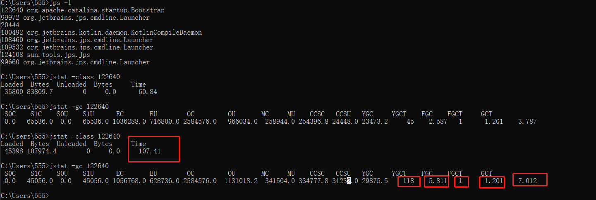
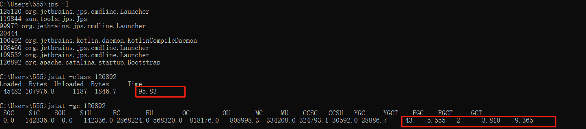
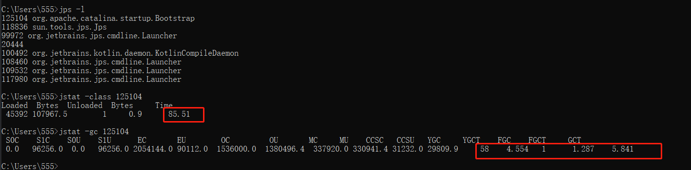
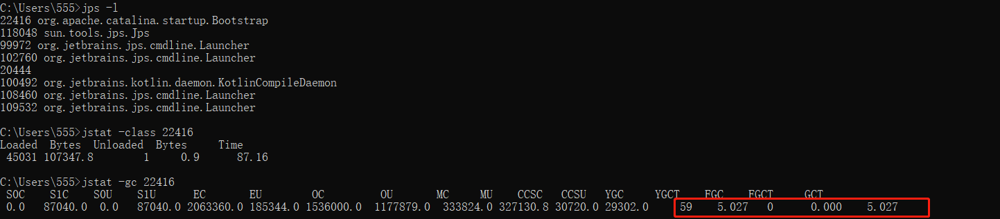

## G1垃圾收集器

### 启动参数设置

```
-XX:+UseG1GC
-XX:+PrintGCDetails
-XX:+PrintGCDateStamps
-Xloggc:../logs/gc.log
-Xms3600M
-Xmx4000M
-Xmn1800M
-XX:+UnlockExperimentalVMOptions
-XX:InitiatingHeapOccupancyPercent=40
-XX:G1NewSizePercent=16
-XX:G1MaxNewSizePercent=35

```

### 日志解读

#### 1. Young GC

```html
<!--【1.总：JVM启动后的相对时间：17.132，收集类型，新生代，Eden区，收集花费时间0.0469581秒，即47毫秒】-->
17.132: [GC pause (G1 Evacuation Pause) (young), 0.0469581 secs]
   <!--【2.详细过程：并行收集任务运行时间18.7毫秒，8个线程执行垃圾回收，可用参数-XX:ParallelGCThreads设置】-->
   [Parallel Time: 18.7 ms, GC Workers: 8]
   	  <!--【JVM启动后17132.7毫秒，第一个垃圾收集线程开始工作；17132.9毫秒后，最后一个手机线程开始工作】-->
      [GC Worker Start (ms): Min: 17132.7, Avg: 17132.8, Max: 17132.9, Diff: 0.3]
      <!--【扫描root集合（线程栈、JNI、全局变量、系统表等）】-->
      [Ext Root Scanning (ms): Min: 0.6, Avg: 1.0, Max: 2.3, Diff: 1.7, Sum: 7.8]
      <!--【处理日志缓冲区，更新Rset，确保当前Region的Rset最新】-->
      [Update RS (ms): Min: 0.0, Avg: 0.0, Max: 0.0, Diff: 0.0, Sum: 0.0]
         [Processed Buffers: Min: 0, Avg: 0.0, Max: 0, Diff: 0, Sum: 0]
      <!--【扫描新生代分区的Rset】-->
      [Scan RS (ms): Min: 0.0, Avg: 0.1, Max: 0.1, Diff: 0.1, Sum: 0.8]
      <!--【扫描root节点】-->
      [Code Root Scanning (ms): Min: 0.0, Avg: 2.5, Max: 16.9, Diff: 16.9, Sum: 20.3]
      <!--【将前面扫描存活对象拷贝到目标Region】-->
      [Object Copy (ms): Min: 0.8, Avg: 14.3, Max: 16.8, Diff: 16.0, Sum: 114.4]
      <!--【垃圾收集线程完成任务，进入临界区】-->
      [Termination (ms): Min: 0.0, Avg: 0.5, Max: 0.6, Diff: 0.6, Sum: 4.2]
         [Termination Attempts: Min: 1, Avg: 79.6, Max: 113, Diff: 112, Sum: 637]
      <!--【垃圾收集线程完成其他任务】-->
      [GC Worker Other (ms): Min: 0.0, Avg: 0.0, Max: 0.1, Diff: 0.0, Sum: 0.3]
      <!--【展示每个垃圾收集线程工作的最大、最小，平均及总共时间】-->
      [GC Worker Total (ms): Min: 18.4, Avg: 18.5, Max: 18.6, Diff: 0.2, Sum: 147.8]
     <!-- 【JVM启动后17151.3毫秒，第一个垃圾收集线程工作结束】-->
      [GC Worker End (ms): Min: 17151.3, Avg: 17151.3, Max: 17151.3, Diff: 0.0]
   <!--【3.新生代GC中的一些任务】-->
   [Code Root Fixup: 0.1 ms]
   [Code Root Purge: 0.0 ms]
   <!--【清理card table】-->
   [Clear CT: 0.5 ms]
   [Other: 27.6 ms]
   	  <!--【选择哪些Region作为CSet】-->
      [Choose CSet: 0.0 ms]
      <!--【处理java中的各种引用】-->
      [Ref Proc: 25.9 ms]
      [Ref Enq: 0.2 ms]
      [Redirty Cards: 0.4 ms]
      <!--【超大对象回收处理】-->
      [Humongous Register: 0.1 ms]
      [Humongous Reclaim: 0.0 ms]
      <!--【释放掉CSet中Region占用的内存空间】-->
      [Free CSet: 0.6 ms]
   <!--【Eden区从占用1024M到回收后0B，分区缩小为969M，Survivors空间从0增长到55M，整个堆空间从1024M占用缩减到54.9M】-->
   [Eden: 1024.0M(1024.0M)->0.0B(969.0M) Survivors: 0.0B->55.0M Heap: 1024.0M(3600.0M)->54.9M(3600.0M)]
 <!--【本次新生代垃圾收集的时间，消耗CPU时间0.22秒，内核态线程消耗CPU时间0.03秒，垃圾收集真正耗时0.05秒】-->
 [Times: user=0.22 sys=0.03, real=0.05 secs] 
```

#### 2. 并发标记周期

```html
<!--【初始标记，STW，触发一次Young GC】-->
188.769: [GC pause (G1 Evacuation Pause) (young) (initial-mark) (to-space exhausted), 0.3093628 secs]
   [Parallel Time: 280.3 ms, GC Workers: 8]
      [GC Worker Start (ms): Min: 188769.5, Avg: 188769.5, Max: 188769.5, Diff: 0.1]
      [Ext Root Scanning (ms): Min: 8.8, Avg: 17.0, Max: 68.9, Diff: 60.1, Sum: 136.1]
      [Update RS (ms): Min: 1.5, Avg: 2.1, Max: 2.4, Diff: 0.9, Sum: 16.5]
         [Processed Buffers: Min: 4, Avg: 6.0, Max: 12, Diff: 8, Sum: 48]
      [Scan RS (ms): Min: 39.3, Avg: 39.5, Max: 39.9, Diff: 0.6, Sum: 316.0]
      [Code Root Scanning (ms): Min: 0.0, Avg: 0.0, Max: 0.1, Diff: 0.1, Sum: 0.2]
      [Object Copy (ms): Min: 169.2, Avg: 221.3, Max: 229.5, Diff: 60.3, Sum: 1770.4]
      [Termination (ms): Min: 0.0, Avg: 0.0, Max: 0.0, Diff: 0.0, Sum: 0.3]
         [Termination Attempts: Min: 1, Avg: 173.4, Max: 218, Diff: 217, Sum: 1387]
      [GC Worker Other (ms): Min: 0.0, Avg: 0.0, Max: 0.0, Diff: 0.0, Sum: 0.1]
      [GC Worker Total (ms): Min: 279.9, Avg: 280.0, Max: 280.0, Diff: 0.1, Sum: 2239.6]
      [GC Worker End (ms): Min: 189049.4, Avg: 189049.4, Max: 189049.5, Diff: 0.0]
   [Code Root Fixup: 0.0 ms]
   [Code Root Purge: 0.0 ms]
   [Clear CT: 0.4 ms]
   [Other: 28.7 ms]
      [Evacuation Failure: 26.7 ms]
      [Choose CSet: 0.0 ms]
      [Ref Proc: 0.1 ms]
      [Ref Enq: 0.0 ms]
      [Redirty Cards: 0.4 ms]
      [Humongous Register: 0.1 ms]
      [Humongous Reclaim: 0.1 ms]
      [Free CSet: 0.6 ms]
   [Eden: 139.0M(2776.0M)->0.0B(2800.0M) Survivors: 24.0M->0.0B Heap: 3972.9M(4000.0M)->3965.9M(4000.0M)]
 [Times: user=0.73 sys=0.03, real=0.31 secs] 
<!--【并发root区域扫描】-->
63.229: [GC concurrent-root-region-scan-start]
63.251: [GC concurrent-root-region-scan-end, 0.0216084 secs]
<!--【并发标记】-->
63.251: [GC concurrent-mark-start]
63.522: [GC concurrent-mark-end, 0.2707228 secs]
<!--【最终标记，修正上一次标记结果】-->
63.522: [GC remark 63.522: [Finalize Marking, 0.0001454 secs] 63.522: [GC ref-proc, 0.0041888 secs] 63.527: [Unloading, 0.0148012 secs], 0.0200650 secs]
 [Times: user=0.17 sys=0.00, real=0.02 secs] 
<!--【独占清理，计算各个区域的存活对象和GC回收比例，并进行排序】-->
63.544: [GC cleanup 481M->480M(3600M), 0.0052624 secs]
 [Times: user=0.00 sys=0.00, real=0.01 secs] 
<!--【并发清理】-->
63.550: [GC concurrent-cleanup-start]
63.550: [GC concurrent-cleanup-end, 0.0000105 secs]
```

#### 3. Mixed GC

并发收集阶段结束后发生；在混合垃圾收集处理的`CSet`不仅包括新生代的分区，还包括老年代分区（并发标记阶段标记出来的那些老年代分区）

老年代的堆占有率达到参数 `-XX：InitiatingHeapOccupancyPercent` 设定的值时触发

```html
241.813: [GC pause (G1 Evacuation Pause) (mixed), 0.0287869 secs]
   [Parallel Time: 23.6 ms, GC Workers: 8]
      [GC Worker Start (ms): Min: 241813.0, Avg: 241813.1, Max: 241813.3, Diff: 0.3]
      [Ext Root Scanning (ms): Min: 1.9, Avg: 3.8, Max: 10.1, Diff: 8.2, Sum: 30.3]
      [Update RS (ms): Min: 0.0, Avg: 5.0, Max: 6.5, Diff: 6.5, Sum: 39.9]
         [Processed Buffers: Min: 0, Avg: 11.5, Max: 41, Diff: 41, Sum: 92]
      [Scan RS (ms): Min: 0.0, Avg: 0.9, Max: 1.2, Diff: 1.1, Sum: 7.3]
      [Code Root Scanning (ms): Min: 0.0, Avg: 0.0, Max: 0.1, Diff: 0.1, Sum: 0.3]
      [Object Copy (ms): Min: 13.1, Avg: 13.5, Max: 13.6, Diff: 0.5, Sum: 107.7]
      [Termination (ms): Min: 0.0, Avg: 0.0, Max: 0.0, Diff: 0.0, Sum: 0.1]
         [Termination Attempts: Min: 1, Avg: 28.3, Max: 40, Diff: 39, Sum: 226]
      [GC Worker Other (ms): Min: 0.0, Avg: 0.1, Max: 0.1, Diff: 0.1, Sum: 0.5]
      [GC Worker Total (ms): Min: 23.0, Avg: 23.3, Max: 23.3, Diff: 0.3, Sum: 186.1]
      [GC Worker End (ms): Min: 241836.3, Avg: 241836.4, Max: 241836.4, Diff: 0.1]
   [Code Root Fixup: 0.1 ms]
   [Code Root Purge: 0.0 ms]
   [Clear CT: 0.5 ms]
   [Other: 4.7 ms]
      [Choose CSet: 0.1 ms]
      [Ref Proc: 3.1 ms]
      [Ref Enq: 0.2 ms]
      [Redirty Cards: 0.1 ms]
      [Humongous Register: 0.1 ms]
      [Humongous Reclaim: 0.1 ms]
      [Free CSet: 0.6 ms]
   [Eden: 988.0M(988.0M)->0.0B(988.0M) Survivors: 36.0M->36.0M Heap: 2170.6M(3600.0M)->1137.8M(3600.0M)]
 [Times: user=0.22 sys=0.00, real=0.03 secs] 
```

#### 4. Full GC

堆内存空间不足以分配新的对象，或者元空间使用率达到设定的阈值，会触发`Full GC`

```html
<!--System.gc()触发的Full GC-->
111.789: [Full GC (System.gc())  841M->629M(3600M), 1.8352739 secs]
   [Eden: 16.0M(1008.0M)->0.0B(1024.0M) Survivors: 16.0M->0.0B Heap: 841.3M(3600.0M)->629.1M(3600.0M)], [Metaspace: 236174K->236173K(1265664K)]
 [Times: user=1.94 sys=0.63, real=1.84 secs] 
```

```html
<!--堆内存分配失败触发的Full GC-->
189.157: [Full GC (Allocation Failure)  3972M->757M(3600M), 1.7356564 secs]
   [Eden: 0.0B(2800.0M)->0.0B(2800.0M) Survivors: 0.0B->0.0B Heap: 3972.9M(4000.0M)->757.5M(3600.0M)], [Metaspace: 299178K->294749K(1327104K)]
 [Times: user=2.59 sys=0.03, real=1.74 secs] 
```


### JVM调优实战

设置启动参数，启动我们的`java`程序

```
-Xverify:none
-XX:+PrintGCDetails
-XX:+PrintGCDateStamps
-Xloggc:../logs/gc.log
-Xms3600M
-Xmx4000M
-Xmn1024M
-XX:MetaspaceSize=280M
-XX:MaxMetaspaceSize=512M
-XX:+UseG1GC
```

> `jps -l` 查看进程信息，找到进程`id`
>
> `jstat -calss [pid]` 查看类加载情况
>
> `jstat -gc [pid] ` 查看进程`gc`情况



类加载时间，107.41秒，`GC`时间7.012秒，`Young GC`次数118次，较为频繁，

> 修改参数配置，初始堆内存调大

`-Xmn2800M`

下面的参数配置是为了让`G1`收集器能够触发`Mixed GC`

`-XX:+UnlockExperimentalVMOptions`
`-XX:InitiatingHeapOccupancyPercent=40`
`-XX:G1NewSizePercent=16`
`-XX:G1MaxNewSizePercent=35`




`Young GC`次数减少，但是触发了`Full GC`，`GC`总时长还是变长了，

```html
<!--经过几次Young GC-->
[Eden: 2617.0M(2617.0M)->0.0B(2776.0M) Survivors: 183.0M->24.0M Heap: 3940.9M(4000.0M)->3833.9M(4000.0M)]
[Eden: 139.0M(2776.0M)->0.0B(2800.0M) Survivors: 24.0M->0.0B Heap: 3972.9M(4000.0M)->3965.9M(4000.0M)]
[Eden: 7168.0K(2800.0M)->0.0B(2800.0M) Survivors: 0.0B->0.0B Heap: 3972.9M(4000.0M)->3972.9M(4000.0M)]
[Eden: 0.0B(2800.0M)->0.0B(2800.0M) Survivors: 0.0B->0.0B Heap: 3972.9M(4000.0M)->3972.9M(4000.0M)]
<!--Young GC之后，对象都到了老年代，堆内存几乎要满了，此时触发Full GC-->
189.157: [Full GC (Allocation Failure)  3972M->757M(3600M), 1.7356564 secs]
   [Eden: 0.0B(2800.0M)->0.0B(2800.0M) Survivors: 0.0B->0.0B Heap: 3972.9M(4000.0M)->757.5M(3600.0M)], [Metaspace: 299178K->294749K(1327104K)]
 [Times: user=2.59 sys=0.03, real=1.74 secs] 
```

> 将初始堆内存适当调小一点，

`-Xmn2000M`



阅读`GC`日志，发现触发了`Full GC`是因为显示调用`System.gc()`，

```
113.168: [Full GC (System.gc())  3107M->629M(3600M), 2.0742394 secs]
   [Eden: 2440.0M(2623.0M)->0.0B(2800.0M) Survivors: 177.0M->0.0B Heap: 3107.3M(3600.0M)->629.3M(3600.0M)], [Metaspace: 234445K->234443K(1263616K)]
 [Times: user=2.80 sys=0.03, real=2.08 secs] 
```

> 使用 `-XX:+DisableExplicitGC` ，禁止显式执行`System.gc()`



调整后启动参数配置如下：

```html
<!--禁掉类加载过程字节码校验-->
-Xverify:none
-XX:+PrintGCDetails
-XX:+PrintGCDateStamps
-Xloggc:../logs/gc.log
-Xms3600M
-Xmx4000M
-Xmn2800M
-XX:MetaspaceSize=280M
-XX:MaxMetaspaceSize=512M
-XX:+UseG1GC
-XX:+UnlockExperimentalVMOptions
-XX:InitiatingHeapOccupancyPercent=40
-XX:G1NewSizePercent=16
-XX:G1MaxNewSizePercent=35
<!--禁止显式执行`System.gc()`-->
-XX:+DisableExplicitGC
```

总结：配合程序应用，分析程序启动过程中产生的gc日志，来深入理解G1垃圾收集器的垃圾回收过程，最后通过启动参数配置来实际调优，认识G1收集器相关启动参数。

