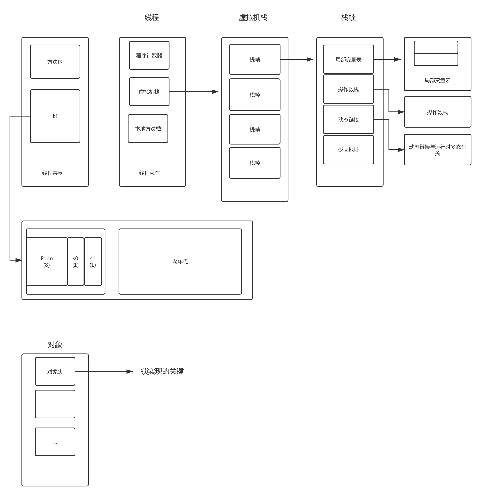
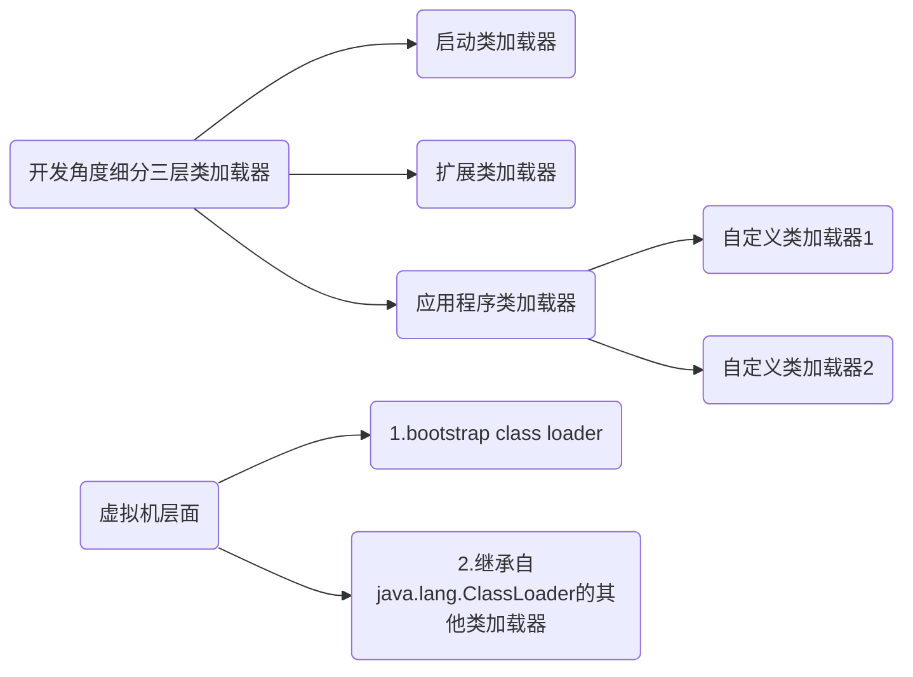
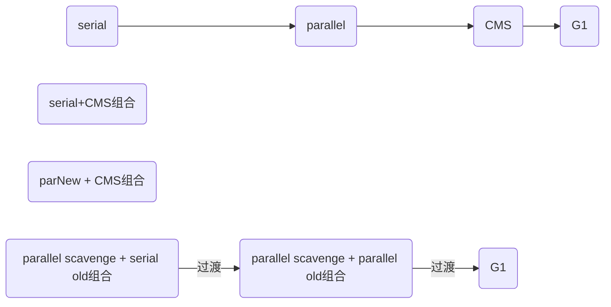
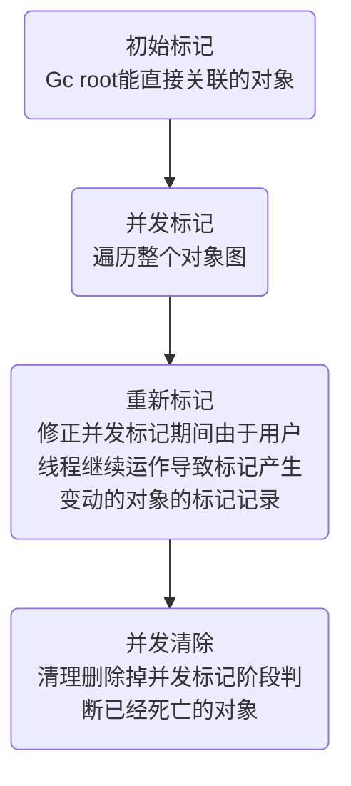
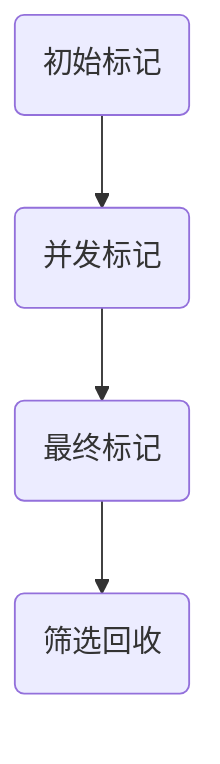

# JVM  

[[toc]]

## `JVM`内存区域

### 运行时数据区域

> 虚拟机栈，方法区，堆，程序计数器，本地方法栈

- **线程共享**

  - 堆（对象实例、对象数组）
    > 从回收内存的角度，基于分代的思想，划分：

    ```tex
    新生代（1/3）
    	Eden（8）
    	survivor1（1）
    	survivor2（1）
    
    老年代（2/3）
    ```

  - 方法区（非堆） | 元空间（`JDK8`在本地内存实现）（存储类型信息、常量、静态变量、即时编译器编译的代码缓存等数据）

    -  运行时常量池：编译期生成的各种字面量和字符引用

- **线程私有**

  -  程序计数器（指向当前线程正在执行的字节码的指令的地址（行号））

  -  本地方法栈（当前线程运行native方法所需数据、指令、返回地址）

  - 虚拟机栈  

       ```tex
       栈帧（方法）:
       
           1.局部变量表（方法中定义的变量）
           
           2.操作数栈（值入栈出栈）
           
           3.动态链接（动态运行时，栈帧所属方法的符号引用转化为直接引用）
           
           4.返回地址（方法退出时，要回到最初方法被调用时的位置）		
           
       ```
  



### 对象内存布局

> 对象在堆内存存储布局分为三块：对象头、实例数据和对齐填充（占位符）

对象头

- 自身运行时数据，包括`hashcode`、`GC分代年龄`、锁状态标志、线程持有的锁、偏向线程id、偏向时间戳
- 类型指针，对象指向它的类型元数据的指针，虚拟机通过这个指针确认对象属于哪个类的实例

> 32位虚拟机中：对象头 = 25位对象`hashcode` + 4位分代年龄 + 2位锁标志 + 1位固定0


## 类加载器  

- 任意一个类 + 加载它的类加载器 ==》其在 Java 虚拟机中的唯一性；每一个类加载器，都有一个独立的类名称空间。

  > 比较两个类是否“相等”，只有在这两个类是由同一个类加载器加载的前提下才有意义，否则，即使这两个类来源于同一个 Class 文件，被同一个虚拟机加载，只要加载它们的类加载器不同，那么这两个类就必定不相等。
  >
  > 这里的“相等”，包括代表类的 Class 对象的 equals() 方法、`isInstance()` 方法的返回结果，也包括使用 `instanceof `关键字做对象所属关系判定等情况。


### **加载器种类**

   - 启动类加载器：负责将存放在 `<JAVA_HOME>\lib` 目录中的，并且能被虚拟机识别的（仅按照文件名识别，如 `rt.jar`，名字不符合的类库即使放在 lib 目录中也不会被加载）类库加载到虚拟机内存中。
   - 扩展类加载器：负责加载 `<JAVA_HOME>\lib\ext` 目录中的所有类库，开发者可以直接使用扩展类加载器。
   - 应用程序类加载器：由于这个类加载器是 `ClassLoader `中的 `getSystemClassLoader() `方法的返回值，所以一般也称它为“系统类加载器”。它负责加载用户类路径（`classpath`）上所指定的类库，开发者可以直接使用这个类加载器，如果应用程序中没有自定义过自己的类加载器，一般情况下这个就是程序中默认的类加载器。




### **双亲委派模型**

> 双亲委派模型是描述类加载器之间的层次关系。它要求除了顶层的启动类加载器外，其余的类加载器都应当有自己的父类加载器。（父子关系一般不会以继承的关系实现，而是以组合关系来复用父加载器的代码）

- **工作过程**：如果一个类加载器收到了类加载的请求，它首先不会自己去尝试加载这个类，而是把这个请求委派给父类加载器去完成，每一个层次的类加载器都是如此，因此所有的加载请求最终都应该传送到顶层的启动类加载器中，只有当父加载器反馈自己无法完成这个加载请求（找不到所需的类）时，子加载器才会尝试自己去加载。（在` java.lang.ClassLoader` 中的 `loadClass() `方法中实现该过程。）
- **原因**：像 `java.lang.Object `这些存放在 `rt.jar` 中的类，无论使用哪个类加载器加载，最终都会委派给最顶端的启动类加载器加载，从而使得不同加载器加载的 Object 类都是同一个。相反，如果没有使用双亲委派模型，由各个类加载器自行去加载的话，如果用户自己编写了一个称为 `java.lang.Object` 的类，并放在 `classpath `下，那么系统将会出现多个不同的 Object 类，Java 类型体系中最基础的行为也就无法保证。


## 类加载过程  


**类加载详细过程**：

1. 加载：

   1. ）通过类的全限定名获取该类的二进制字节流

   2. ）将二进制流所代表的静态结构转化为方法区的运行时数据结构

   3. ）在内存中创建一个代表该类的`java.lang.Class`对象，作为方法区中这个类的各种数据的访问入口

2. 验证：

   1. ）文件格式，字节流是否符合class文件格式的规范，并且能被当前版本的虚拟机处理
   2. ）元数据验证 ，对字节码描述信息进行语义分析，确保其符合`java`语法规范
   3. ）字节码验证 对方法体进行语义分析，保证方法在运行时不会对虚拟机造成危害
   4. ）符号引用验证，在解析阶段，确保解析正常执行

3. 准备：正式为类变量（或者静态成员变量）分配内存并设置初始值，这些变量（不包括实例变量）所使用的内存都在方法区进行分配

4. 解析：虚拟机将常量池中的符号引用替换为直接引用

5. 初始化：执行类构造器`<clinit>()`方法的过程

   `<clinit>()`方法是由编译器自动收集类中的所有类变量的赋值动作和静态语句块中语句合并产生的，编译器收集的顺序是由语句在源文件中出现的顺序所决定的。
   
   **5种情况会触发初始化：**
   
   1）遇到`new、getstatic、putstatic、invokestatic`这四条季节吗指令的时候，如果类没有经过初始化，则需要触发类的初始化。场景是：new实例化对象、设置类的静态字段、读取类的静态字段、调用类的静态方法。
   
   2）使用`java.lang.reflect`包的方法对类进行反射调用的时候，如果类没有进行过初始化，则需要触发其初始化
   
   3）当初始化一个类的时候，发现其父类还没有进行过初始化，则需要先触发其父类的初始化
   
   4）当虚拟机启动的时候，用户需要指定一个要执行的主类，即包含main方法的类，虚拟机会先初始化这个主类
   
   5）当使用`jdk1.7`动态语言支持时，如果一个`java.lang.invoke.MethodHandle`实例最后的解析结果是 `REF_getstatic`,`REF_putstatic`,`REF_invokeStatic`的方法句柄，并且这个方法句柄对应的类没有进行初始化，则主要触发其初始化


## 内存分配与回收策略  

- **对象优先在Eden区分配**

- **大对象直接进入老年代**：`-XX:PretenureSizeThreshold `参数，大于这个设置值的对象直接在老年代分配，这样做的目的是避免在 Eden 区及两个 Survivor 区之间发生大量的内存复制。

  - **长期存活的对象将进入老年代**：`JVM` 给每个对象定义了一个对象年龄计数器。当新生代发生一次 `Minor GC `后，存活下来的对象年龄 +1，当年龄超过一定值时，就将超过该值的所有对象转移到老年代中去。使用`-XXMaxTenuringThreshold `设置新生代的最大年龄，只要超过该参数的新生代对象都会被转移到老年代中去。

- **动态对象年龄判定**：如果当前新生代的 Survivor 中，相同年龄所有对象大小的总和大于 Survivor 空间的一半，年龄 >= 该年龄的对象就可以直接进入老年代，无须等到 `MaxTenuringThreshold `中要求的年龄。

- **空间分配担保**：通过清除老年代中废弃对象来扩大老年代空闲空间，以便给新生代作担保。

  **可能触发` JVM `进行` Full GC`的情况：**

  - `System.gc() `方法的调用
  - 老年代空间不足


## 判断对象是否存活

- 引用计数法：在对象头维护着一个 counter 计数器，对象被引用一次则计数器 +1；若引用失效则计数器 -1。当计数器为 0 时，就认为该对象无效了。弊端：难解决对象之间循环引用的问题。

- 可达性分析法：所有和 `GC Roots `根对象直接或间接关联的对象都是有效对象，和 `GC Roots` 没有关联的对象就是无效对象。

  `GC Roots `包括：

  - Java 虚拟机栈（栈帧中的本地变量表）中引用的对象
  - 本地方法栈中引用的对象
  - 方法区中常量引用的对象
  - 方法区中类静态属性引用的对象

  `GC Roots` 并不包括堆中对象所引用的对象，这样就不会有循环引用的问题。
  
  

## 垃圾回收算法  

> 分代收集理论

- 复制算法（新生代）
- 标记-清理
- 标记-整理

  

## 垃圾收集器  



- `Serial` 最早出现的垃圾收集器

> 单线程，在进行垃圾收集时，会暂停其他工作线程（`stop the world`)

- `ParNew`，`serial`的多线程并行版，新生代收集器（与`serial`一样带有空间压缩整理的能力，采用指针碰撞的分配算法来给对象分配内存）；

- `Serial old`

- `parallel Scavenge`

> 致力于达到一个可控制的吞吐量（吞吐量=用户线程执行时间/用户线程执行时间+垃圾收集线程执行时间）

- `parallel old`
- `CMS`：老年代的收集器，（基于清除算法，采用空闲列表来给对象分配内存）；

> 首次实现了让垃圾收集线程与用户线程（基本上）同时工作，致力于缩短回收停顿时间。

​	运作过程



- `G1`

> 面向全堆的收集器，不需要和其他收集器配合一起工作
>
> 使用region划分内存空间，并且维护优先级列表（跟踪各个region区域回收所获得的空间大小以及回收所需时间数据）

​	运作过程




## 线程安全与锁优化

> 当多个线程同时访问一个对象时，如果不用考虑这些线程在运行时环境下的调度和交替执行，也不需要进行额外的同步，或者在调用方进行任何其他的协调操作，调用这个对象的行为都会获得正确的结果，那就称这个对象是线程安全的。

### 实现线程安全

#### 互斥同步，（互斥实现同步）

- `synchronized`关键字

  > `synchronized`关键字经过`javac`编译后，会在同步块前后形成`monitorenter`和`monitorexit`两条字节码指令

  `monitorenter`指令--》线程尝试获取对象的锁，如果对象没被锁定，或者当前线程已经持有对象的锁，锁的计数器的值加1

  `monitorexit`，锁的计数器的值减1。一旦锁的计数器的值为0，锁释放

  获取对象锁失败，当前线程被阻塞等待，直到请求锁定的对象被持有它的线程释放。

- `Lock`接口

  `ReentrantLock`，与`Synchronized`相比，增加了一些高级功能：

  （1）等待可中断

  （2）可实现公平锁

  （3）锁绑定多个条件

#### 非阻塞同步（基于冲突检测的乐观并发策略）

- `CAS`

### 锁优化

- 自旋锁与自适应锁

  - 锁时间很短，让请求锁的线程等待，执行忙循环（自旋），不放弃处理器执行时间，避免线程切换的开销。 使用：`-XX:+UseSpinning`开启；自旋次数默认10次，可使用参数`-XX:PreBlockSpin`自行修改。
  - 自适应锁是对自旋锁的优化，自旋的时间由前一次在同一个锁的自旋时间和获取锁的线程的状态来决定

- 锁消除

  对不可能存在共享数据竞争的锁进行消除，在编译器即时编译之后，会忽略同步措施直接执行

- 锁粗化

  在循环内对同一个对象反复进行加锁和解锁，频繁的互斥同步操作消耗性能，这种场景直接将锁粗化到外部，加一次锁即可

- 轻量级锁

  > 对于绝大部分锁，在整个同步周期内不存在竞争，通过使用CAS操作避免使用互斥量的开销

  代码进入同步块，同步对象未被锁定（锁标志位"01"），虚拟机在当前线程的栈帧中建立一个名为锁记录的空间，用于存储目前对象`Mark Word`的拷贝，然后虚拟机使用`CAS`操作尝试将`Mark Word`更新为指向锁空间的指针。

  操作成功即标识线程成功获取锁，对象的锁标志位更新为"00"，标识对象处于轻量级锁状态；

  如果操作失败，意味着有其他线程竞争，虚拟机会先检查`Mark Word`是否指向当前线程栈帧，如果是，那么表名当前线程已经获取到该锁；否则说明锁对象已经被其他线程抢占。

  如果存在两个以上的线程竞争同一把锁，这个时候锁膨胀为重量级锁，锁标志变为"10"。

- 偏向锁

  > 消除数据再无竞争的情况下的同步操作
  >
  > 启用参数：-XX:UseBiasedLocking

  当锁对象第一次被线程获取时，虚拟机将`Mark Word`标识为"01"，偏向模式设置为"1"；同时使用`CAS`操作将获取锁的线程id记录到`Mark Word`；如果CAS成功，持有偏向锁的线程以后每次进入这个锁的相关同步块的时候，虚拟机可以不再执行同步操作；

  一旦出现另外的线程尝试获取锁，会结束偏向模式，如果当前锁对象未被锁定，撤销偏向，偏向模式设置为"0"；标志位会变成"01"（未锁定状态）或者"00"（轻量级锁状态）

  

## `JVM`调优（待补充）

```properties
//
控制台打印gc日志，通过设置JVM参数设置

-Xms20m -Xmx20m -Xmn10m -XX:+PrintGCDetails 
-XX:+PrintGCTimeStamps 打印日志信息
-Xloggc:log_gc.log gc日志输出文件
```

### CPU高 问题定位思路

（1）`top` 命令找出 CPU最高的进程id
（2）`top -H -p pid`  找到进程下CPU高的线程列表
（3）`printf "%x\n" tid` 将线程号转为16进制，方便下一步查找
	`jstack pid | grep tid -A10` 找到java线程的堆栈信息，分析业务

找到CPU高的程序。
也有可能是gc占据高CPU，这时要关注一下耗时较长的线程，可能有大对象gc时不能释放内存