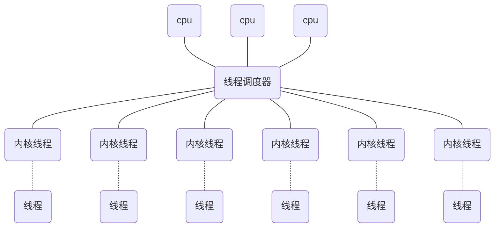
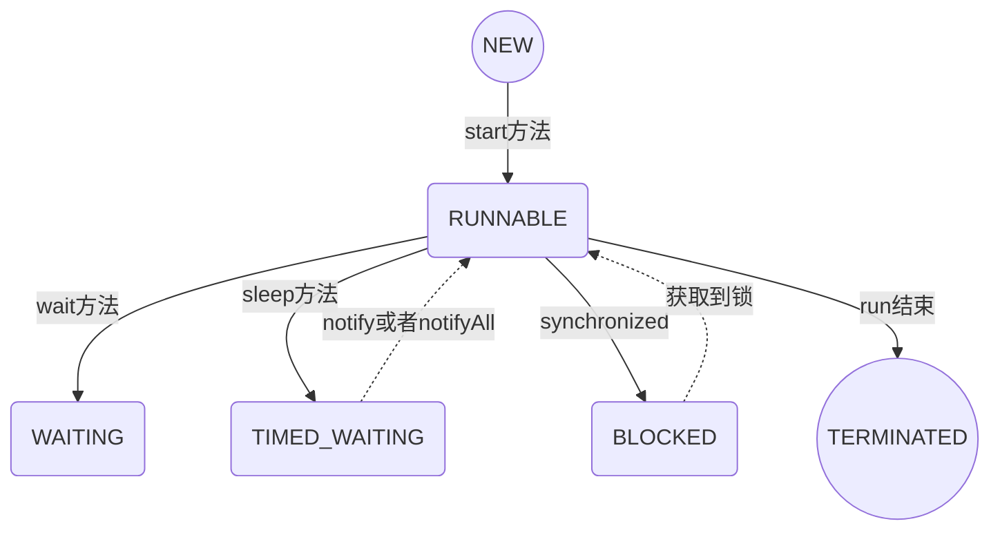
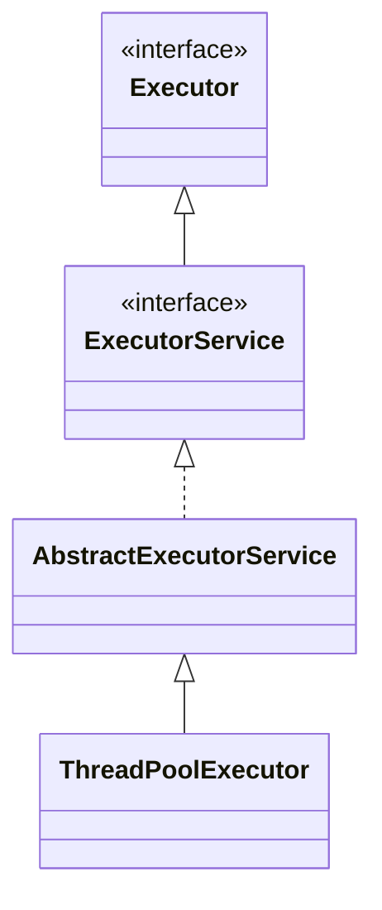
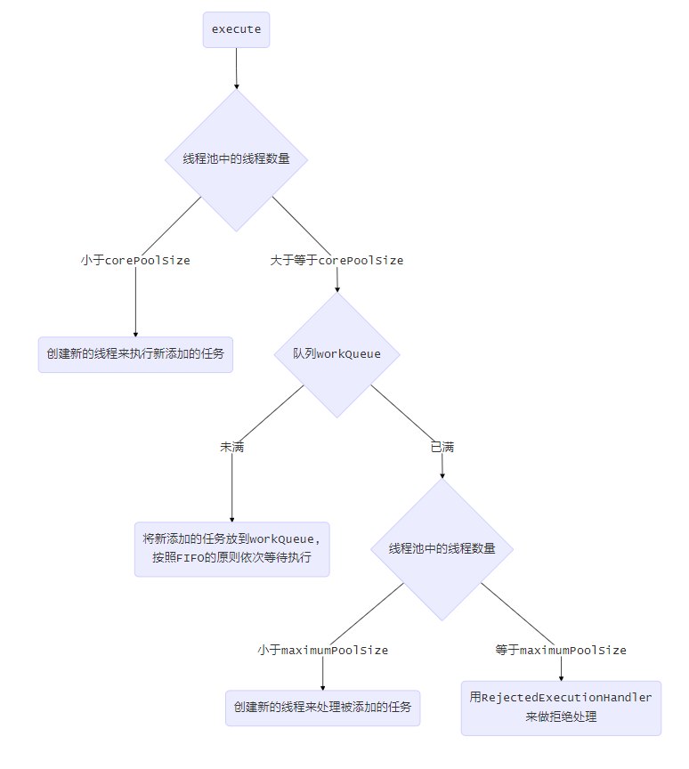
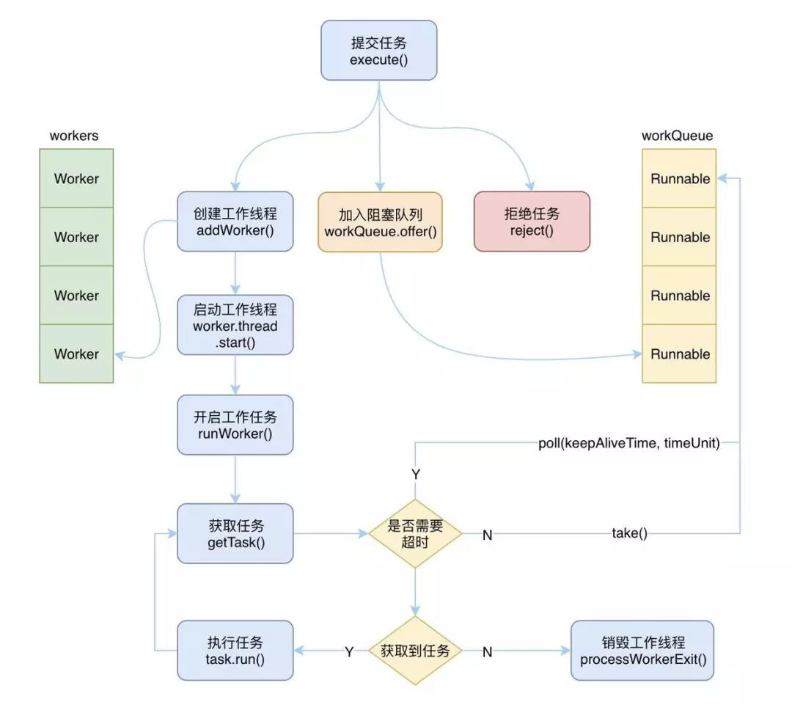

# 多线程  

## 一、线程

> 线程是`CPU`资源调度的基本单位

### 线程与`java`线程

#### 实现线程的方式

（1）内核线程实现，调度器对线程进行调度，将线程任务映射到各个处理器执行



（2）用户线程实现

线程的创建，销毁，切换和调度这些操作都由用户程序自己处理，不需要系统内核的支持，实现比较复杂

（3）混合实现

多对多的线程模型

#### `java`线程的实现

操作系统支持怎样的线程模型，很大程度上也会影响`java虚拟机`的线程怎么映射的，这一点在不同个平台上很难达到一致，因此，`java虚拟机`规范不去限定`java线程`使用那种线程模型来实现。

#### `java线程`调度

> 线程调度是系统为线程分配处理器使用权的过程

两种调度方式：协同式线程调度和抢占式线程调度

`java线程`调度就是使用的抢占式线程调度，每个线程由系统分配执行时间，线程的切换不由线程自身决定

#### `java线程`状态切换

6种线程状态：`NEW、RUNNABLE、WAITING、TIMED_WAITING、BLOCKED、 TERMINATED`




## 二、java线程池  

### java线程池实现



主要接口： `ExecutorService`

实现类： `ThreadPoolExecutor`  

### 线程池执行流程

  

### 线程池工作流程

  

- 线程池状态  
  - **running**  运行状态，改状态下线程可以接受新的任务，也可以处理阻塞队列中的任务  
  - **shutdown**  待关闭状态，不再接受新的任务，继续处理阻塞队列中的任务，当阻塞队列中的任务为空，并且工作线程数为0时，进入tidying状态  
  - **stop**  停止状态，不接受新任务，也不处理阻塞队列中的任务，并且会尝试结束执行中的任务，当工作线程数为0时，进入tidying状态  
  - **tidying**  整理状态，此时任务都已经执行完毕，并且没有工作线程，执行terminated方法进入terminated状态  
  - **terminated**  终止状态，此时线程完全终止，并完成资源的释放  

- 拒绝策略  
	丢
	忽视
	执行任务
	从队列踢出一个最先进入的任务
	
```

allowCoreThreadTimeout=true  
clt变量控制状态 生效线程数、线程运行状态

```

### 创建线程池

#### Executors静态工厂创建线程池

1. **newFixedThreadPool**  

```java
/**创建一个指定工作线程数的线程池，其中参数 corePoolSize 和 maximumPoolSize 相等，阻塞队列基于LinkedBlockingQueue,具有线程池提高程序效率和节省创建线程时所耗的开销的优点。但是在线程池空闲时，即线程池中没有可运行任务时，它也不会释放工作线程，还会占用一定的系统资源; **/
public static ExecutorService newFixedThreadPool(int nThreads, ThreadFactory threadFactory) {
  return new ThreadPoolExecutor(nThreads, nThreads,
                                0L, TimeUnit.MILLISECONDS,
                                new LinkedBlockingQueue<Runnable>(),
                                threadFactory);	
}
```

2. **newSingleThreadExecutor**  
```  java
/**初始化的线程池中只有一个线程，如果该线程异常结束，会重新创建一个新的线程继续执行任务，唯一的线程可以保证所提交任务的顺序执行，内部使用LinkedBlockingQueue作为阻塞队列**/
 public static ExecutorService newSingleThreadExecutor(ThreadFactory threadFactory) {
  return new FinalizableDelegatedExecutorService
      (new ThreadPoolExecutor(1, 1,
                              0L, TimeUnit.MILLISECONDS,
                              new LinkedBlockingQueue<Runnable>(),
                              threadFactory));
 }
```

3. **newCachedThreadPool**  

```  java
/**创建一个可缓存工作线程的线程池，默认存活时间60秒，线程池的线程数可达到Integer.MAX_VALUE，即2147483647，内部使用SynchronousQueue作为阻塞队列;在没有任务执行时，当线程的空闲时间超过keepAliveTime，则工作线程将会终止，当提交新任务时，如果没有空闲线程，则创建新线程执行任务，会导致一定的系统开销  **/
public static ExecutorService newCachedThreadPool(ThreadFactory threadFactory) {
return new ThreadPoolExecutor(0, Integer.MAX_VALUE,
							  60L, TimeUnit.SECONDS,
							  new SynchronousQueue<Runnable>(),
							  threadFactory);
 }
```

4. **newScheduledThreadPool**  
```java
/**初始化的线程池可以在指定的时间内周期性的执行所提交的任务，在实际的业务场景中可以使用该线程池定期的同步数据**/
public static ScheduledExecutorService newScheduledThreadPool(
      int corePoolSize, ThreadFactory threadFactory) {
  return new ScheduledThreadPoolExecutor(corePoolSize, threadFactory);
}

public ScheduledThreadPoolExecutor(int corePoolSize,
                                   ThreadFactory threadFactory) {
    super(corePoolSize, Integer.MAX_VALUE, 0, NANOSECONDS,
          new DelayedWorkQueue(), threadFactory);
}
```

#### ThreadPoolExecutor手动创建线程池

```java
//创建线程池
private final ThreadPoolExecutor threadPoolExecutor = new ThreadPoolExecutor(corePoolSize, maximumPoolSize, keepAliveTime, unit,
            new LinkedBlockingQueue<>(), new ThreadPoolExecutor.AbortPolicy());

public ThreadPoolExecutor(int corePoolSize,//核心线程数
                          int maximumPoolSize,//最大线程数
                          long keepAliveTime,//空闲线程存活时间
                          TimeUnit unit,//空闲线程存活时间单位
                          BlockingQueue<Runnable> workQueue,//任务队列
                          ThreadFactory threadFactory,//创建线程的工厂	
                          RejectedExecutionHandler handler//拒绝策略)
```

#### 核心线程数分配


	【两个考虑点：cpu io】
		【CPU密集】  大部分场景是纯CPU计算，本质是要提升CPU的利用率，考虑CPU在多线程之间切换耗时
		
			（线程等待时间+线程CPU时间）/线程CPU时间*CPU数目*利用率
			
			举例：【4核CPU】
			
				任务 任务执行时间 分配线程 
				500  0.2     
				1 / 0.2 = 5*4=20*利用率（0.8）=16个线程
				等待时间占比越高，需要越多线程。
			
		【IO密集】   IO操作时间相当于CPU计算时间非常长，要将硬件的性能发挥到一致
		
			最佳线程数：IO耗时/CPU耗时+1
## 三、代码示例

```  java
//创建实现Callable接口的任务类
public class MaterialUploadTask implements Callable<MaterialUploadResult> {
    private MaterialUploadBean bean;
    private ClService clService;
    private TYwgyDzjzWs ws;
    @Override
    public MaterialUploadResult call() throws Exception {
    	//具体业务处理逻辑
        return clService.uploadCl(bean, ws);
    }
}

//创建执行类
public class ClExecutor {
	private ExecutorService streamMaterialUploadTask；
	@PostConstruct
	public void init(){
		//初始化一个线程池
		streamMaterialUploadTask = new ThreadPoolExecutor(5, 20 , 60L, TimeUnit.SECONDS, new LinkedBlockingDeque<Runnable>(100000), 
		new ThreadFactoryBuilder().setNameFormat("materialUploadExecutor-pool-%d").build(), new ThreadPoolExecutor.AbortPolicy());
	}
	
	public Future<MaterialUploadResult> asynUploadExecute(StreamMaterialUploadTask task) {
		return streamMaterialUploadTask.submit(task);
	}
}

//具体使用
private ClExecutor clExecutor;
Future<MaterialUploadResult> uploadResultFuture = clExecutor.asynUploadExecute(
                    new MaterialUploadTask(bean, clService, ws));
```


