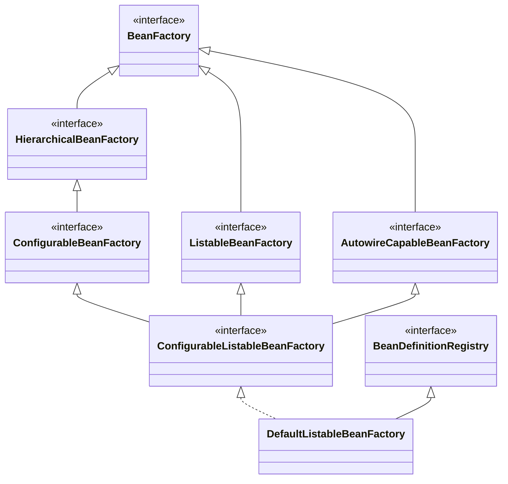
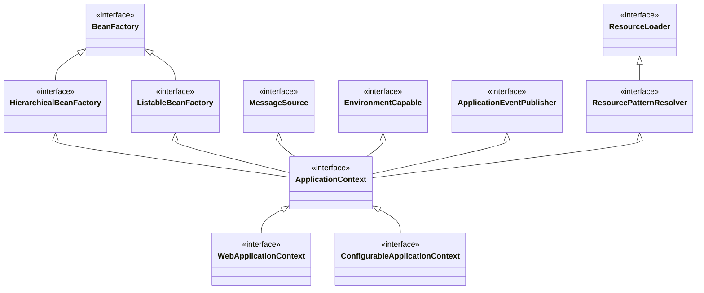
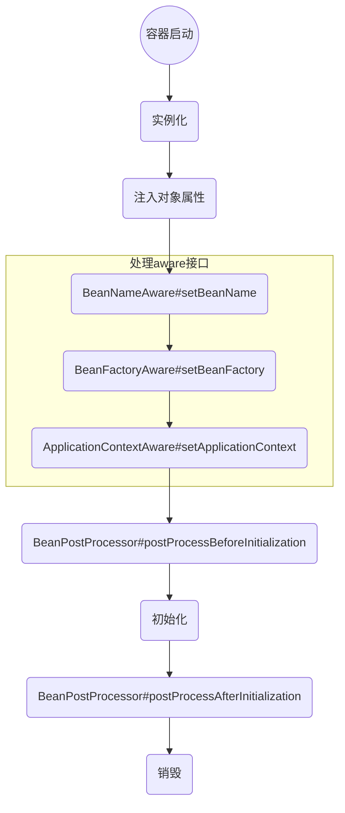
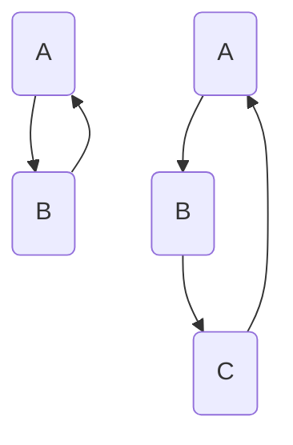
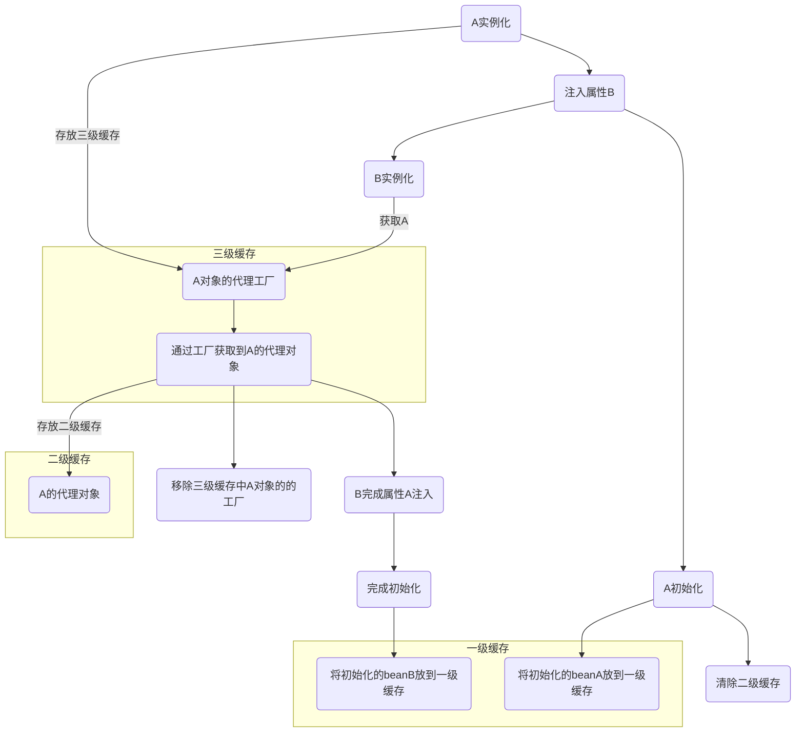
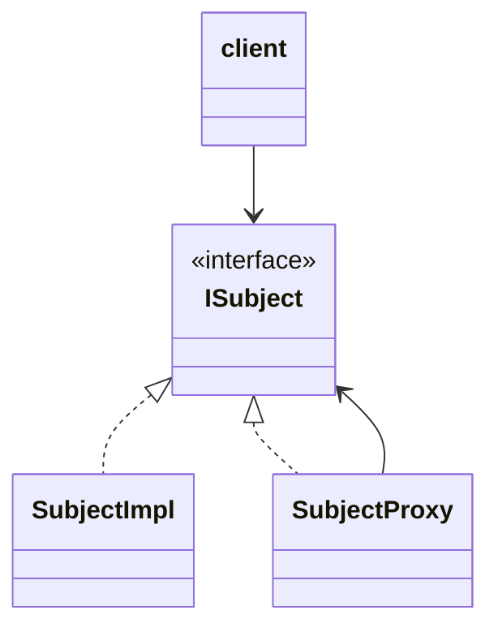

# Spring

## spring注解
```java
@Configuration 配置类;
@Bean 注册组件
@Scope 默认单例;
@Lazy 懒加载;
@Conditional 按照条件给容器中注册组件
@ComponentScan

@Import：快速给容器导入一个组件;
	ImportSelector
	ImportBeanDefinitionRegister
	
@PropertySource(value={"classpath:/xx.properties"})，加载外部配置文件;
@Value赋值：基本数值、#{}、${};

@Autowired：自动装配 spring利用依赖注入，完成对容器中各个组件的依赖关系赋值；
	1）默认按照类型去容器中找对应的组件;
	2）如果找到多个类型相同的组件，再将属性的名称作为组件的ID去容器中查找;
	3）@Qualifier("属性名称")，指定需要装配的组件的ID，而不是使用属性名;
	4）自动装配默认要将属性赋值好，没有就会报错，可以使用@Autowired(required=false);
	5）@Primary，让spring自动装配的时候，默认使用首选bean，也可以继续使用@Qualifier指定装配
	
	
@Profile：指定组件在哪个环境下才能被注册到容器中，不指定则任何环境都不能注册该组件

	1）加了环境标识的bean，只有这个环境被激活的时候，才能注册到容器中；默认是default环境
	
	2）该注解写在配置类上，在指定环境，该配置类中的配置才能生效
	
	3）没有标注环境标识的bean，任何环境都是加载的
	
	激活环境方式：
		1）使用命令行动态参数，在虚拟机参数位置加载-Dspring.profiles.active=dev
		2）代码的方式激活环境 		
			1.创建IOC容器
			2.设置需要激活的环境（applicationContext.getEnvironment().setActiveProfiles("test","dev")）
			3.注册主配置类（applicationContext.register(Config.class)）
			4.启动刷新容器refresh()

```


## IOC容器

### `BeanFactory`简单容器系列

> `BeanFactory`定义了最基本的获取bean信息的功能，后续接口继承并扩展，增加了父容器管理、bean后置处理功能等。



### `ApplicationContext`高级容器系列

> `ApplicationContext`继承了`BeanFactory`接口体系中的`HierarchicalBeanFactory`接口、`ListableBeanFactory`接口；除此之外还继承了其他的接口：`MessageSource`、`EnvironmentCapable`、`ApplicationEventPublisher`、`ResourceLoader`等，丰富了容器的特性。



### `IOC`容器启动过程

加载配置元数据，解析为`BeanDefinition`（`BeanDefinition`保存了bean的定义信息），`beanDefinition`注册到`BeanDefinitionRegistry`

### 依赖注入

两种注入方式

（1）构造器注入

（2）setter方法注入


### bean生命周期



### `Spring bean`循环依赖

#### 循环依赖



> `Spring`中使用三级缓存来解决循环依赖问题。

#### 三级缓存

```java
/** Cache of singleton objects: bean name --> bean instance */
//一级缓存，缓存了经历过整个bean生命周期的bean
private final Map<String, Object> singletonObjects = new ConcurrentHashMap<String, Object>(256);

/** Cache of singleton factories: bean name --> ObjectFactory */
//三级缓存，缓存了objectFactory，主要用来去生成原始对象进行了aop之后得到的代理对象
private final Map<String, ObjectFactory<?>> singletonFactories = new HashMap<String, ObjectFactory<?>>(16);

/** Cache of early singleton objects: bean name --> bean instance */
//二级缓存，缓存了实例化完成的原始对象，还没有执行属性填充以及后置处理器方法
private final Map<String, Object> earlySingletonObjects = new HashMap<String, Object>(16);	
```

核心方法
```java
protected Object getSingleton(String beanName, boolean allowEarlyReference) {
	Object singletonObject = this.singletonObjects.get(beanName);
	if (singletonObject == null && isSingletonCurrentlyInCreation(beanName)) {
		synchronized (this.singletonObjects) {
			singletonObject = this.earlySingletonObjects.get(beanName);
			if (singletonObject == null && allowEarlyReference) {
				ObjectFactory<?> singletonFactory = this.singletonFactories.get(beanName);
				if (singletonFactory != null) {
					singletonObject = singletonFactory.getObject();
					this.earlySingletonObjects.put(beanName, singletonObject);
					this.singletonFactories.remove(beanName);
				}
			}
		}
	}
	return (singletonObject != NULL_OBJECT ? singletonObject : null);
}
```
执行过程

1. 先从一级缓存获取对象，获取到直接返回

2. 如果一级缓存没有获取到对象，并且当前对象正在创建中，尝试从二级缓存获取，获取到即返回

3. 如果二级缓存没有获取到对象，尝试从三级缓存获取

创建`bean`执行过程



相关代码方法
```java
//主要方法 创建bean，方法内部有关于对循环依赖的处理
//creates a bean instance, populates the bean instance, applies post-processors, etc
org.springframework.beans.factory.support.AbstractAutowireCapableBeanFactory#doCreateBean
```

```java
org.springframework.beans.factory.support.AbstractAutowireCapableBeanFactory
{
	//创建bean
	createBean(String beanName, RootBeanDefinition mbd, Object[] args){
    	//实例化
    	createBeanInstance()
            
         //如果当前创建的是单例bean，并且允许循环依赖，将objectFactory放入三级缓存
		//singletonFactories{key:beanName,value:ObjectFactory}
   		addSingletonFactory(beanName, new ObjectFactory<Object>() {
			@Override
			public Object getObject() throws BeansException {
				return getEarlyBeanReference(beanName, mbd, bean);
			}
		});
    
    	//注入属性
    	populateBean(){
             //尝试获取依赖的bean, 如果bean还没有实例化，走createBean
    		//从三级缓存拿到依赖的bean，放到二级缓存，将该依赖bean从三级缓存remove
			beanFactory.getBean(beanName, requiredType);
        };
        //初始化，走完一个生命周期，bean放到一级缓存里
        initializeBean()
}   

```

> 为什么要有三级缓存？

一级缓存的作用，它是一个单例池，保证bean的单例属性

三级缓存，存放对象的代理工厂，它的作用就是存放半成本的单例bean；为什么不直接存这个半成本bean，而是存它的代理工厂，因为有`AOP`

- 如果 bean 有 `AOP`，就创建一个代理对象；
- 如果 bean 没有 `AOP`，就返回原对象。

二级缓存，就是用来存放工厂生成的对象，这个对象可能是原对象，也可能是个代理对象。

> 为什么要有二级缓存

如果 bean 需要进行`AOP`，并且它又被多个其他的 bean 所依赖，那么每次被依赖注入时，bean会生成多个代理对象，为了避免这种重复创建代理对象，把代理对象缓存下来，放到二级缓存，这样，下次再需要时，直接从二级缓存获取即可


## Spring AOP

### AOP相关概念

- `joinPoint `

  > 连接点，横切织入点

- `pointCut `

  > 切点，指定符合条件的一组`joinPoint`

  表达形式：

  （1）指定`joinPoint`所在方法名称

  （2）正则表达式

  （3）特定的`pointCut`表述语言

- `advice`

  > 织入到连接点的横切逻辑

  （1）`beforeAdvice`

  （2）`afterAdvice`，包括`afterReturningAdvice`、`afterThrowingAdvice`

  （3）`aroundAdvice`

- `aspect`

  > 对很切关注点逻辑进行模块化封装的AOP概念实体

### Spring AOP

> 动态代理和字节码增强技术来实现，在程序运行期间为目标对象生成代理对象，将横切逻辑加入到代理对象中

**静态代理**




**动态代理**

- `JDK`动态代理

> 基于`Proxy`类和`InvocationHandler`接口实现，为实现了相应接口的目标对象生成代理对象实例。
>
> `Proxy`用来生成动态代理实例，`InvocationHandler`实现横切点逻辑。

> 对于没有实现任何接口的目标对象，使用`cglib`为目标对象生成动态代理对象实例。

- `cglib`动态代理

  > 生成目标对象的子类，对目标对象进行重写扩展功能。
  >
  > Enhancer用来动态生成目标对象的子类，`MethodInterceptor`接口完成横切逻辑

**实际应用**

1. 定义切面类（类上加注解`@Aspect`、`@EnableAspectJAutoProxy`）	
   `@Aspect`，告诉`spring`哪个类是切面类

   `@EnableAspectJAutoProxy`，开启基于注解的aop模式

​	1.1 切面类的方法上标注通知注解，写切入点表达式，匹配业务逻辑类方法

​		`@Pointcut("@annotation(com.*.*.AnnotationInterface)")`
​		`@PointCut("execution(* com.*.*.service.*.methodName(..))")`

​	1.2 通知方法：

​		前置通知（`@Before`）：在目标方法运行前运行

​		后置通知（`@After`）：在目标方法运行结束之后运行

​		返回通知（`@AfterReturning`）：目标方法正常返回后运行

​		异常通知（`@AfterThrowing`）：出现异常时运行

​		环绕通知（`@Around`）：手动推进目标方法运行（joinPoint.procced）


```java
@Aspect
@EnableAspectJAutoProxy
public class CustomAspect {
    @Before("pointCut()")
    public void beforeMethod(JoinPoint joinPoint){}

    @After(value = "pointcut()")
    public void afterMethod() {

    }

    @AfterReturning(value = "pointCut()", returning = "returnValue")
    public void afterReturning(JoinPoint joinPoint, Object returnValue) {

    }

    @AfterThrowing(value = "pointCut()", throwing = "e")
    public void afterThrowing(RuntimeException e){}

    @Around(value = "pointCut()")
    public void aroundMethod(ProceedingJoinPoint point){

    }
}

```


### @EnableAspectJAutoProxy

	@EnableAspectJAutoProxy
		@Import(AspectJAutoProxyRegistrar.class)
			利用AspectJAutoProxyRegistrar给容器中注册bean: AnnotationAwareAspectJAutoProxyCreator
			
		AnnotationAwareAspectJAutoProxyCreator
			---
			---implements 后置处理器、自动装配beanFactory
			
	    创建AnnotationAwareAspectJAutoProxyCreator过程：
	        1）传入配置类，创建IOC容器
	        2）注册配置类，调用refresh()，刷新容器
	        3）registerBeanPostProcessor(beanFactory);注册bean的后置处理器，来方便拦截bean的创建
	            1）先获取IOC容器已经定义了的需要创建对象的所有的BeanPostProcessor
	            2）给容器中加别的BeanPostProcessor
	            3）优先注册实现了PriorityOrdered接口的BeanPostProcessor
	            4）在容器中注册实现了Ordered接口的BeanPostProcessor
	            5）注册没实现优先级接口的BeanPostProcessor
	            6）注册BeanPostProcessor，实际上是创建BeanPostProcessor对象，保存在容器中
	            7）把BeanPostProcessor添加到BeanFactory中
	        4）完成BeanFactory的初始化

### @EnableTransactionManagement

	@EnableTransactionManagement
		利用TransactionManagementConfigurationSelector给容器中导入组件，
			AutoProxyRegistrar，给容器中注册AutoProxyCreator组件，利用后置处理器机制在对象创建以后，包装对  象，返回一个代理对象（增强器），代理对象执行方法利用拦截器链调用
			ProxyTransactionManagementConfiguration，给容器中注册事务增强器，事务拦截器


## spring事务传播特性

> 调用者事务与被调用者事务之间的关系

### **七种事务传播行为**

1. mandatory       

> 使用当前事务，如果当前没有事务，就抛出异常。强制性。

2. requires_new     

> 新建事务，如果当前有事务，把当前事务挂起。

（1）在外围方法未开启事务的情况下`Propagation.REQUIRES_NEW`修饰的内部方法会新开启自己的事务，且开启的事务相互独立，互不干扰。
（2）在外围方法开启事务的情况下`Propagation.REQUIRES_NEW`修饰的内部方法依然会单独开启独立事务，且与外部方法事务也独立，内部方法之间、内部方法和外部方法事务均相互独立，互不干扰。

3. required         

> 如果当前没有事务，则新建一个事务，若有，就加入到这个事务中。最常见的选择。

（1）在外围方法未开启事务的情况下`Propagation.REQUIRED`修饰的内部方法会新开启自己的事务，且开启的事务相互独立，互不干扰。
（2）在外围方法开启事务的情况下`Propagation.REQUIRED`修饰的内部方法会加入到外围方法的事务中，所有`Propagation.REQUIRED`修饰的内部方法和外围方法均属于同一事务，只要一个方法回滚，整个事务均回滚。

4. nested           

> 如果当前存在事务，则在嵌套事务内执行。如果当前没有事务，则执行与required类似的操作。

（1）在外围方法未开启事务的情况下`Propagation.NESTED`和`Propagation.REQUIRED`作用相同，修饰的内部方法都会新开启自己的事务，且开启的事务相互独立，互不干扰。
（2）在外围方法开启事务的情况下`Propagation.NESTED`修饰的内部方法属于外部事务的子事务，外围主事务回滚，子事务一定回滚，而内部子事务可以单独回滚而不影响外围主事务和其他子事务

5. supports         

> 支持当前事务，如果没有事务，就以非事务方式执行。

6. not_supported    

> 以非事务的方式执行操作，如果当前存在事务，则挂起事务。

7. never           

> 以非事务的方式执行，如果当前存在事务，则抛出异常。

### **事务失效场景**

1. `@Transaction`注解用在非`public`方法上

2. `propagation`属性设为`not_supported`，`never`，也会失效

3. 同一个类中方法调用会导致事务失效

4. 一个方法内多数据源的情况下会失效

5. 数据库引擎不支持事务，例如：`MySQL`的`myIsam`引擎不支持事务，`innodb`引擎支持事务

6. 数据源 没有配置事务管理器，例如`jdbc`和`mybatis`用的`DataSourceTransactionManager`

   

## 自定义拦截器

### `spring mvc`拦截器

实现`HandlerInterceptor`接口

> `spring-webmvc`包下面，可以获取`HttpServletRequest`和`HttpServletResponse`等web对象实例。
>
> 接口请求时，`spring MVC`拦截器能够自动拦截接口，做权限校验等操作

**使用场景**：日志记录，统计，权限认证

1. 自定义拦截器，实现`HandlerInterceptor`接口，重写接口的三个方法

```java
public class LoggerAnnotationInterceptor implements HandlerInterceptor
{
	//目标方法执行前执行
    @Override
    public boolean preHandle(HttpServletRequest request, HttpServletResponse response, Object handler)
                throws Exception
    {
    	//eg:
		if(false){
			return false;
		}
		return true;
    }
    
    //目标方法执行后执行，如果preHandle方法返回false，不会执行到该方法
    @Override
    public void postHandle(
                HttpServletRequest request, HttpServletResponse response, Object handler, ModelAndView modelAndView)
                throws Exception
    {

    }
    
    //请求完成时执行
    @Override
    public void afterCompletion(
                HttpServletRequest request, HttpServletResponse response, Object handler, Exception ex)
                throws Exception
    {
		//这里可以实现统一日志记录
    }
}

```

2. 配置拦截器

```xml
<mvc:interceptors>
   <ref bean="customerSpringMvcInterceptor" />
   <ref bean="loggerAnnotationInterceptor" />
</mvc:interceptors>    
```


### `spring`拦截器

实现`MethodInterceptor`接口

> `spring-aop`包下面，拦截的目标是方法

1. 自定义拦截器，实现`MethodInterceptor`接口，重写`invoke`方法

```java
public class DbAnnotationInterceptor implements MethodInterceptor {
	@Override
    public Object invoke(MethodInvocation methodInvocation) throws Throwable {
         //额外功能，例如方法上加了某个注解@
        if(methodInvocation.getMethod().isAnnotationPresent(*.class)){
            //todo
        }
        return methodInvocation.proceed();
    }
}

```

2. 配置拦截器

```xml
<bean id="dbAnnotationInterceptor"
	class="*.DbAnnotationInterceptor">
</bean>
<aop:config>
    <!--切点，表达式用于匹配目标方法-->
	<aop:pointcut id="dbAnnotionPoint"
			expression="@annotation(*.annotation.Database) " />
    <!--通知器，-->
	<aop:advisor pointcut-ref="dbAnnotionPoint"
			advice-ref="dbAnnotationInterceptor" />
</aop:config>
```


### 全局异常处理

使用`@RestControllerAdvice`

```java
@RestControllerAdvice
public class GlobalExceptionHandler {

    @ExceptionHandler(Exception.class)
    public String handleException(Exception e) {
        if (e instanceof ArithmeticException) {
            return "data exception";
        } else if (e instanceof BusinessException){
            return "business exception";
        } else {
            return "server exception";
        }
    }
}
```

