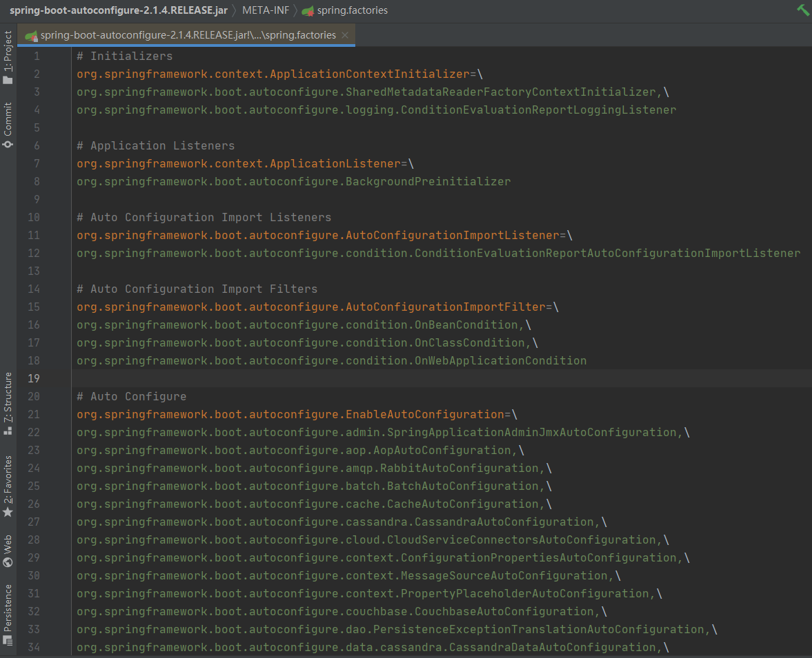
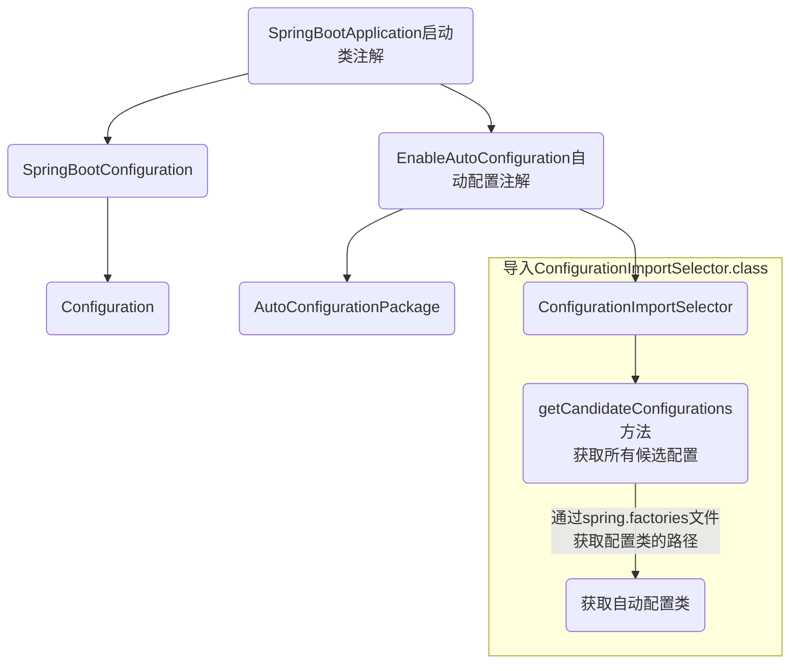
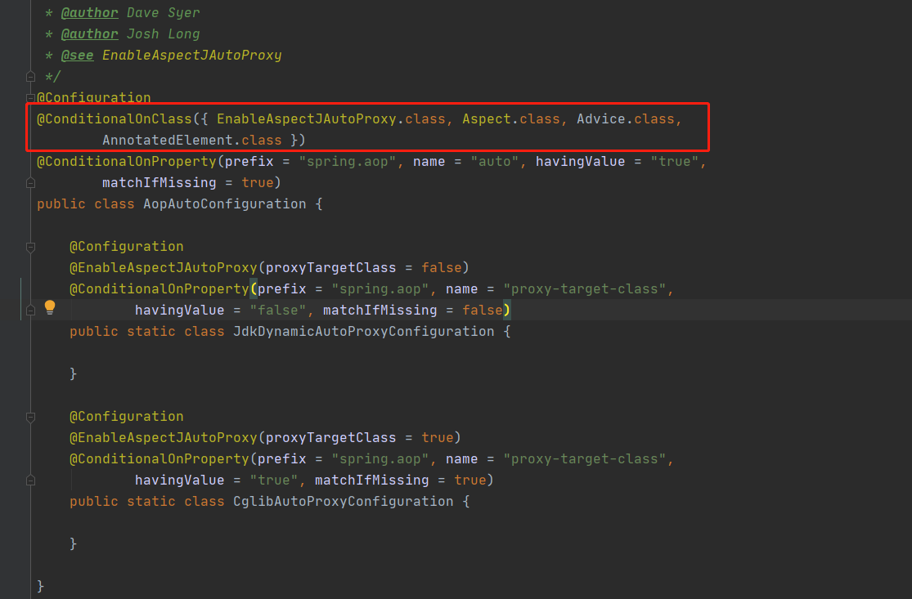
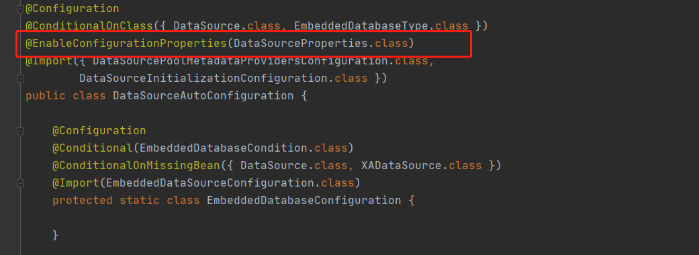
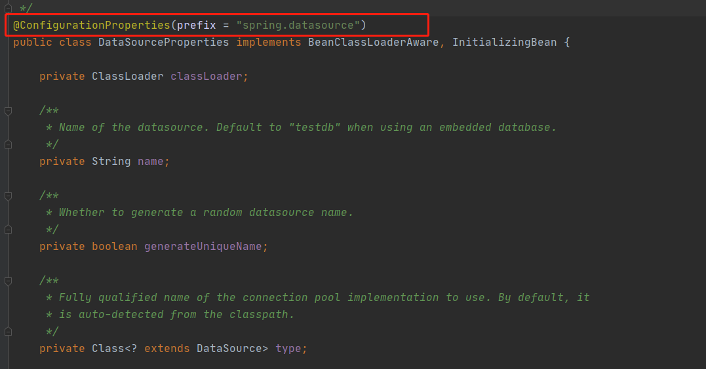

# SpringBoot

## springboot自动配置原理


从启动类开始分析

```java
//启动类注解
@SpringBootApplication
public class ServerApplication {
    public static void main(String[] args) {
        SpringApplication.run(ServerApplication.class, args);
    }
}
```

1. 启动类注解：`@SpringbootApplication`，`springboot `项目启动的核心

`@SpringbootApplication`内部

```java
@Target(ElementType.TYPE)
@Retention(RetentionPolicy.RUNTIME)
@Documented
@Inherited
//核心注解
@SpringBootConfiguration
@EnableAutoConfiguration
@ComponentScan(excludeFilters = {
      @Filter(type = FilterType.CUSTOM, classes = TypeExcludeFilter.class),
      @Filter(type = FilterType.CUSTOM,
            classes = AutoConfigurationExcludeFilter.class) })
public @interface SpringBootApplication {}
```

它是由多个注解组成，里面包括几个核心的注解：

1. 1`@SpringbootConfiguration`

```java
@Target(ElementType.TYPE)
@Retention(RetentionPolicy.RUNTIME)
@Documented
//核心
@Configuration
public @interface SpringBootConfiguration {

}
```

里面包含了`@Configuration`注解，代表自己是一个Spring的配置类。

1. 2`@EnableAutoConfiguration`

```java
@Target(ElementType.TYPE)
@Retention(RetentionPolicy.RUNTIME)
@Documented
@Inherited
//自动配置包
@AutoConfigurationPackage
@Import(AutoConfigurationImportSelector.class)
public @interface EnableAutoConfiguration {}
```

顾名思义，允许自动配置，里面包括：

1. 2.1 `@AutoConfigurationPackage` - 自动配置包

1. 2.2 `@Import(AutoConfigurationImportSelector.class)`，帮我们导入了`AutoConfigurationImportSelector`类

​		`org.springframework.boot.autoconfigure.AutoConfigurationImportSelector#selectImports#getCandidateConfigurations`关键方法

```java
//获取候选的配置
List<String> configurations = getCandidateConfigurations(annotationMetadata,
      attributes);

protected List<String> getCandidateConfigurations(AnnotationMetadata metadata,
			AnnotationAttributes attributes) {
    	//获取启动类所需要的所有配置资源
		List<String> configurations = SpringFactoriesLoader.loadFactoryNames(
				getSpringFactoriesLoaderFactoryClass(), getBeanClassLoader());
		Assert.notEmpty(configurations,
				"No auto configuration classes found in META-INF/spring.factories. If you "
						+ "are using a custom packaging, make sure that file is correct.");
		return configurations;
	}

//使用@EnableAutoConfiguration的类，正是springboot的启动类
protected Class<?> getSpringFactoriesLoaderFactoryClass() {
		return EnableAutoConfiguration.class;
	}
```

这个方法可以帮我们获取自动配置的所有类名，该方法会先去加载`META-INF/spring.factories`文件



该文件下定义了一堆需要自动配置的类信息，`springboot`找到这些配置类的路径，然后去加载这些类，这些配置类可以完成以前需要手动配置的东西。



`springboot`在启动的时候，读取`spring.factories`，根据里面定义的自动配置类全类名，对这些自动配置类进行扫描并加载，但不是所有存在于`spring.factories`的配置类都需要去加载，而是通过`@ConditionalOnClass`注解进行判断，如果注解中的类都存在，才去加载该配置类



**结论**

- `SpringBoot`在启动的时候从类路径下的`META-INF/spring.factories`中获取`EnableAutoConfiguration`指定的值
- 将这些值作为自动配置类导入容器， 自动配置类就会生效，帮我们进行自动配置工作；
- 所有需要导入的组件以全类名的方式返回 ，这些组件将会被添加到容器中 ；
- 容器中导入这些自动配置类（xxxAutoConfiguration），就是给容器中导入启动时需要的所有组件；
- 有了自动配置类，免去了我们手动编写配置注入功能组件等工作；
- 整个J2EE的整体解决方案和自动配置都在`springboot-autoconfigure`的jar包中；


## 自动配置类与yml配置

> `springboot`自动配置类是如何读取yml配置的

`yml`文件中配置了一些存在于自动配置类的中的属性，那么自动配置类在启动的时候是如何找到这些属性配置的？

打开`DataSourceAutoConfiguration`配置类，





`@ConfigurationProperties`注解里面的 `value` 正是我们在`yml` 里面的配置属性

因此，通过`@ConfigurationProperties`注解，可以把`yml`中配置的属性值注入到自动配置类的属性中。

我们自定义配置类，也可以使用该注解，同时，在`yml`中配置相应的属性值


本节完~~