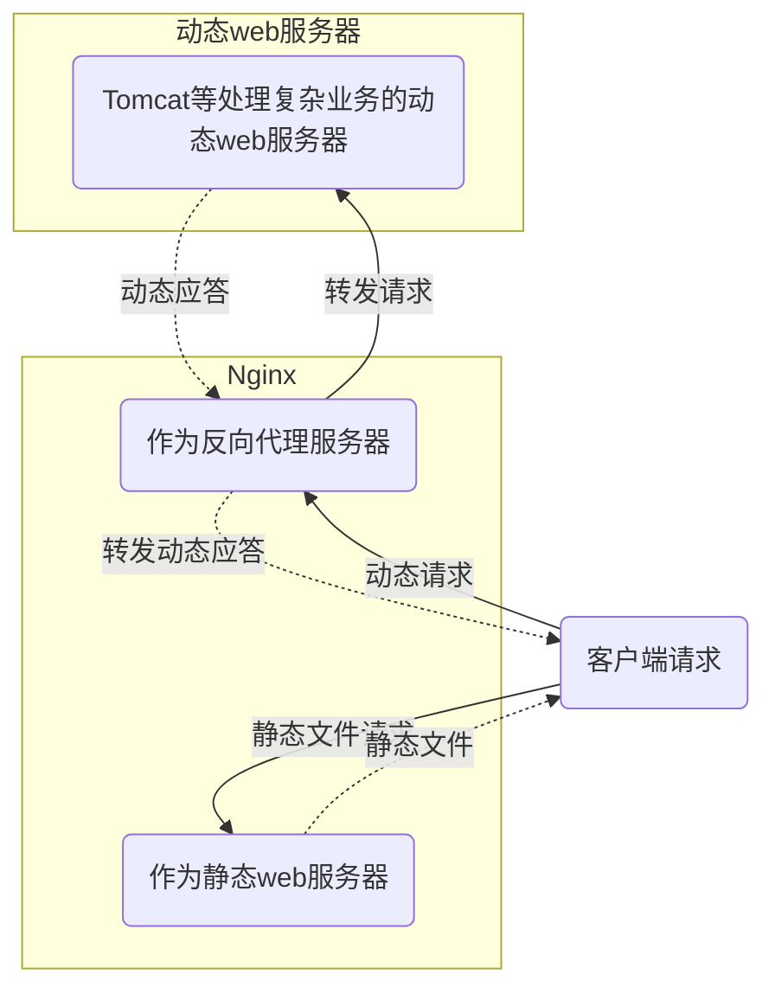
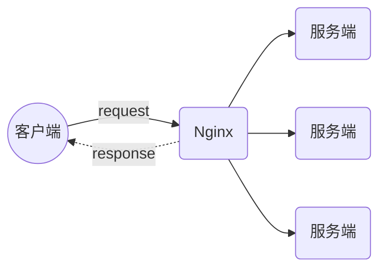
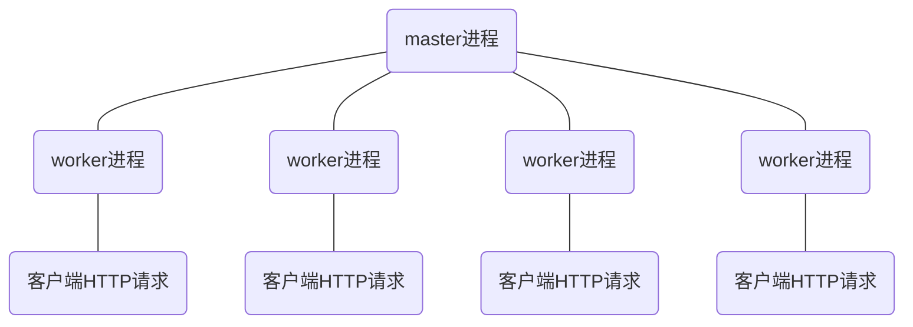

## nginx

> 高性能HTTP和反向代理服务器。

## 前言

### 反向代理

作为服务端的代理服务，接收客户端的请求，将请求转发内网服务器，并将服务器处理结果返回客户端。

对服务端透明，对客户端不透明。

### 正向代理

作为客户端的代理，向目标服务器发出请求。

对客户端透明，对服务端不透明。

### 选择Nginx

选择使用一个服务器之前，要从以下几个方面综合考量

1. 效率：快

2. 成本：内存消耗少

3. 是否可靠：稳定性高，宕机概率很低 

4. 是否强大：高并发连接

5. 是否方便：开源，配置简单，支持热部署


## 核心概念

### 动静分离

在 `web` 服务器架构中，将静态页面与动态页面或者静态内容接口和动态内容接口分开不同系统访问。

`Nginx`作为静态代理服务器，反向代理服务器



### 负载均衡

> `Nginx`实现负载均衡，将请求转发给服务器集群



#### 负载均衡策略

- 轮询：默认策略，将客户端请求轮询发给服务端

- 最小连接数：将请求优先分给压力最小的服务器

- 最快响应时间：将请求优先分给响应时间最短的服务器

- 客户端`IP`绑定：来自同一个`IP`的请求固定分给一台服务器

  

## 配置相关

配置文件 `nginx.conf`

### 主配置项

```conf
# 指定运行 Nginx 的 woker 子进程的属主和属组，其中组可以不指定
user  nobody;

# 指定 Nginx 启动的 worker 子进程数量。
worker_processes  1;

# 指定运行 Nginx master 主进程的 pid 文件存放路径。
pid   logs/nginx.pid;
```

`Nginx`进程间的关系



### 块配置项

```conf
#Nginx 服务器与用户的网络连接
events {
	# Nginx 使用何种事件驱动模型。可选值为：select、poll、kqueue、epoll、/dev/poll、eventport
	use epoll; #使用epoll的IO模型
	
	# worker 子进程能够处理的最大并发连接数。
	worker_connections 1024; 
	
	# 是否打开负载均衡互斥锁。
	accept_mutex on # 默认是off关闭的
	...
}
```

```conf
#代理、缓存、日志定义
http {

	#定义上游服务器集群，做负载用
    upstream {
        ...
    }
    
	#指定服务器名称（域名或IP：port）
    server {
        listen       80;       # 配置监听的端口
        server_name  localhost;    # 配置的域名

		# 配置路径
        location / {
        	# 指定静态资源目录位置
            root /html;
            index index.html;
            deny "具体ip";
            allow "具体IP";
        }
        error_page 500 502 503 504 /50x.html;
        error_page 400 404 error.html;
        ...
    }
	...
}
```

### 反向代理配置

核心：`upstream`、`proxy_pass`

```conf
# 设置上游服务名称，可以proxy_pass指令中使用的代理服务器，默认的负载均衡是轮询
upstream "servername" {
	# 定义上游服务器地址
	server "ip:port weight=1 max_fails=2 fail_timeout=10s";
	server "ip:port weight=2 max_fails=2 fail_timeout=10s";
	server "ip:port weight=3 max_fails=2 fail_timeout=10s";
	
	# 限制每个 worker 子进程与上游服务器空闲长连接的最大数量。
	keepalive 32;
	# 单个长连接可以处理的最多 HTTP 请求个数。
  	keepalive_requests 50;
  	
  	# 空闲长连接的最长保持时间。
 	keepalive_timeout 30s;
	......
}

upstream "servername" {
	ip_hash;
	server "ip:port";
	server "ip:port";
	server "ip:port down";
	......
}

server {
	listen "port";
	server_name "server_name";
	
	location /
	{
		# 用于配置代理服务器
		proxy_pass http://"servername"；
		proxy_set_header Host "server_name"
	}
}
```

#### 反向代理配置示例

```conf
http {    
	upstream demo {
		# 作为上游服务器
		server localhost:8085 weight=1;    
		keepalive 32;
         keepalive_requests 80;
         keepalive_timeout 20s;
	}
	
    server {
        listen       80;
        server_name  localhost;

        location /proxy {
        	root   html;
        	index  index.html index.htm;
	    	proxy_pass http://demo/proxy;
        }
    }
}
    
```

访问`http://demo/proxy`代理即可转发到后台`localhost:8085`服务

#### 负载均衡配置示例

```conf
upstream demo_server {
	# ip_hash; 
	# least_conn;
	# hash $request_uri; #使用 request_uri 变量作为 hash 的 key 值
    server localhost:8020;
    server localhost:8030;
    server localhost:8040;
}

server {
    listen 80;
    server_name localhost;
  
    location /balance/ {
  	  proxy_pass http://demo_server;
    }
}

server{
    listen 8020;
    location / {
  	  return 200 'return 8020 \n';
    }
}

server{
    listen 8030;
    location / {
  	  return 200 'return 8030 \n';
    }
}

server{
    listen 8040;
    location / {
  	  return 200 'return 8040 \n';
    }
}

```

访问`http://demo_server/balance`，请求将会分发到上游三个服务器