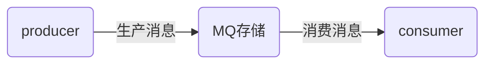
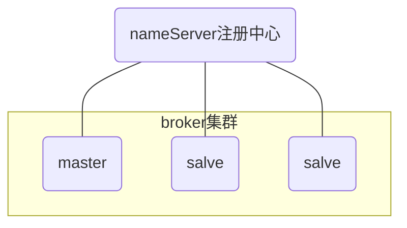
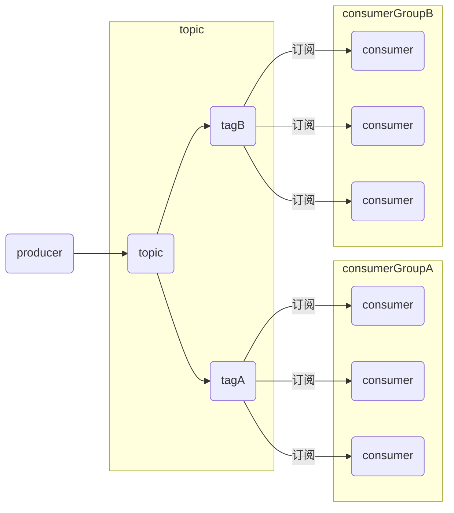
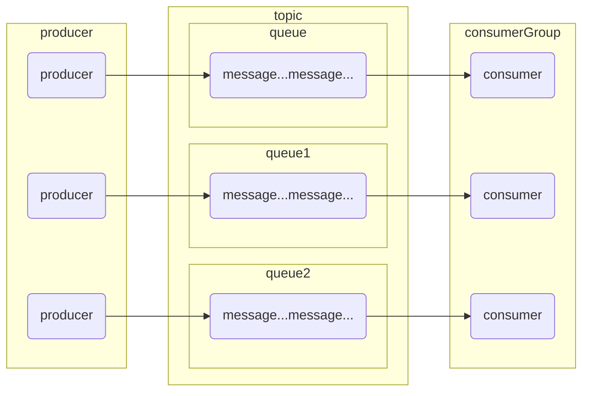
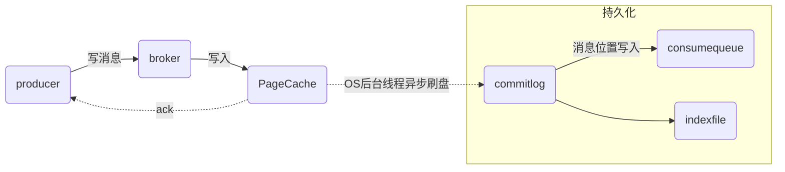
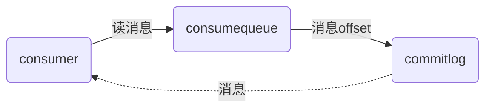

# RocketMQ

## 前言

### 为什么使用MQ（优点）

1. 服务之间的**解耦**

2. **异步**的场景

3. 高并发下**削峰**

### MQ的缺点

1. 服务**可用性**降低
2. 系统**复杂性**增加

## RocketMQ设计浅析

### 几个概念

`nameServer`、 `broker`

`producer`、` consumer`

`topic`、`tag`、`queue`

> 消息的一个生命周期概括下来就是：生产、存储、消费

#### 消息生产

`producer`

> 消息生产者，生产消息的服务

#### 消息消费

`consumer`

> 消息消费者，消费生产者投放在MQ中的消息

#### 消息存储

`nameServer`

> `nameServer`是`RocketMQ`的服务注册中心（类似`zookeeper`），用来保存`broker`元信息，管理`topic`和`broker`路由信息

`broker`

> `broker`是消息存储中心，用于存储`producer`生产的消息，同时还存储一些元信息，包括队列信息、消费进度偏移量；

需先启动`nameServer`再启动`broker`；

（1）`broker`启动时，会注册到`nameServer`；

（2）`nameServer`和`broker`保持长链接，间隔30秒检查`broker`是否存活，超过两分钟没有心跳，则断开连接；

（3）`producer`生产消息，会根据`topic`到`nameServer`获取到`broker`的路由信息，进而和`broker`取得连接；

`topic`

> 消息主题，对存储的消息进行逻辑分类

`tag`

> 消息标签，`topic`的下一层级对消息更细粒度的分类

消费者可订阅指定主题，来消息该主题下的消息

同一个消费者组下的消费者实例订阅的消息`topic`，`tag`必须完全一致

订阅关系：`rocketMQ`系统中消费者获取消息、处理消息的规则和状态配置。订阅关系按照消费者分组和主题粒度进行设计。

`message queqe`

> 消息队列，消息实际存储单元容器，一个主题包含一个或多个队列

### 数据存储设计（持久化）

1. `commitlog`文件：存储消息主体。写入消息过程中追求极致的**磁盘顺序写**性能，所有主题的消息写入一个文件，并将第一个消息的物理偏移量作为文件名。

（消息在文件中的物理地址 = 消息偏移量 - 文件名）

2. `consumequeue`文件：逻辑消息队列，`commitlog`文件基于`topic`的索引文件，保存了指定`topic`下的队列消息在`commitlog`的`offset`、`size`、`tag`的`hashcode`

（`commitLog` 与 `consumequeue` 文件的关联：消息直接进入` commitLog` 文件，存储实际内容；之后 `broker` 通过定时任务 `ReputService` 每1ms将消息的偏移量写入 `consumequeue`。）

3. `indexfile`为索引数据文件提供访问服务，根据`key`进行消息查询

#### producer端

#### consumer端

## FAQ

### 高可用

`namesvr`集群、 `broker`集群 + 主从

### 如何保证消息不重复消费

消息消费完，会发送确认信息，消息显示`consumed_success`。
意外的情况，消息消费了，但是`MQ`刚好重启，消息没有消费成功的状态，就会再被消费一次。消费者保证，消费幂等。

### 消息可靠性传输

1. 生产者生产消息，可能由于网络问题，没有发送到`MQ`，程序会抛异常，重试机制

2. `MQ`的问题，服务意外挂掉 ，持久化机制，在重启后将持久化数据加载到内存

3. 消费者将消息弄丢，确认机制自动关闭改为手动，只有当消息消费完成，才发送确认`ack`

