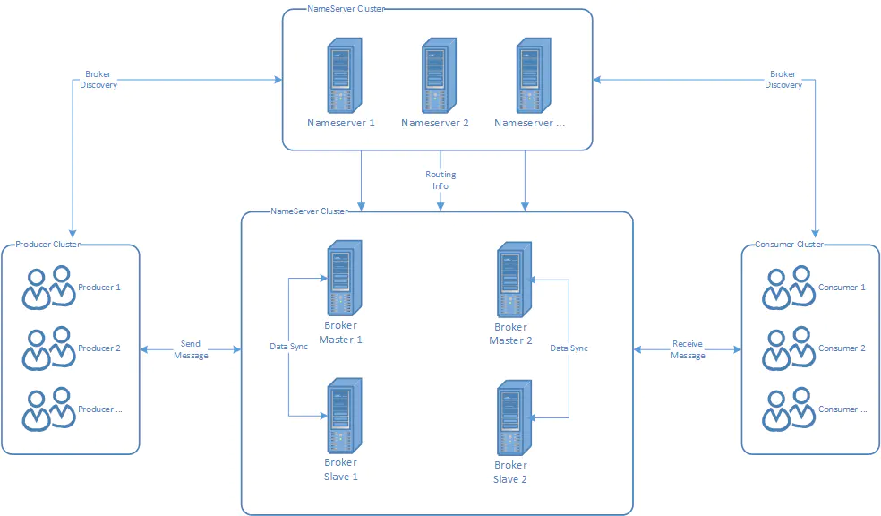
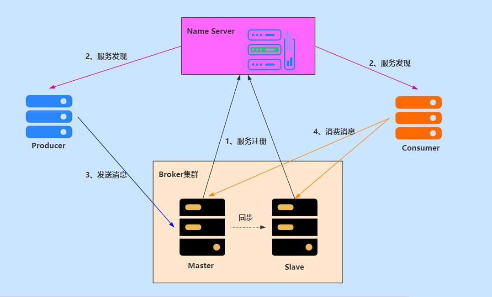

# RocketMQ

## 前言：

### 为什么使用MQ

1.服务之间的解耦

2.异步的场景

3.高并发下削峰

### MQ的缺点

1.服务可用性降低
2.系统复杂性增加

## rocketMQ

### 特点：

基于磁盘存储，无限积压、高吞吐、低延迟

### 基本概念：

producer、 consumer、 nameServer、 broker

topic、tag、queue

nameServer是RocketMQ的服务注册中心（类似zookeeper），用来保存broker元信息，需先启动nameServer再启动broker；

（1）broker启动时，会注册到nameServer；

（2）producer生产消息，会根据topic到nameServer获取到broker的路由信息，进而和broker取得连接；

（3）nameServer和broker保持长链接，间隔30秒检查broker是否存活，超过两分钟没有心跳，则断开连接；

broker是消息存储中心，用于存储producer生产的消息，同时还存储一些元信息，包括队列信息、消费进度偏移量；

运转流程：

### 存储设计

1.commitlog文件：存储消息主体。写入消息过程中追求极致的磁盘顺序写性能，所有主题的消息写入一个文件，并将第一个消息的物理偏移量作为文件名。

（消息在文件中的物理地址=消息偏移量-文件名）

2.consumequeue文件：commitlog文件基于topic的索引文件，以此提高根据主题检索消息的效率

（commitLog 与 consumequeue 文件的关联：消息直接进入 commitLog 文件，存储实际内容；之后 broker 通过定时任务 ReputService 每1ms将消息的偏移量写入 consumequeue。）

### 高可用

namesvr集群、 broker集群+主从

### 如何保证消息不重复消费

消息消费完，会发送确认信息，消息显示consumed_success.
意外的情况，消息消费了，但是MQ刚好重启，消息没有消费成功的状态，就会再被消费一次。消费者保证，消息的唯一性。

### 消息可靠性传输

1.生产者生产消息，可能由于网络问题，没有发送到MQ，程序会抛异常，重试机制

2.MQ的问题，服务意外挂掉 ，持久化机制，在重启后将持久化数据加载到内存

3.消费者将消息弄丢，确认机制自动关闭改为手动，只有当消息消费完成，才发送确认ack

