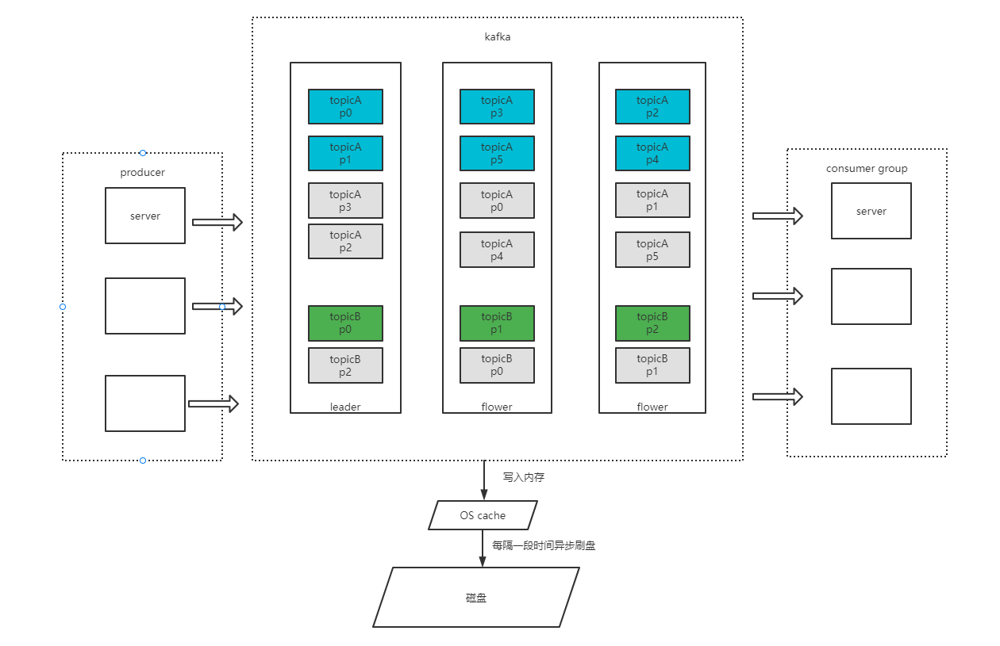

## kafka 


### 为何使用kafka 

吞吐量大，速度快

- 磁盘顺序读

kafka的消息是顺序写到磁盘文件的末尾，以此能提升写入性能。topic的每个分区都是一个文件，收到消息，kafka会把消息插入到文件的末尾。
每个消费者对其订阅的topic都有一个offset来表示读取到了第几条数据。

- 页缓存

利用操作系统本身的page cache来优化读写性能，kafka的读写基于内存，速度快

- 零拷贝

- 分区分段+索引

kafka 的消息按topic分类存放，一个topic的消息又是可以存放到多个partition，每个分区对应一个broker节点，这个符合分布式系统的设计思想。
每个分区又会分段，消息实际上存放在各个分区的segment上，每次文件操作就是操作这个segment，为了进一步的优化，kafka为每个分段文件建立一个索引文件。
这种设计提高了读取速率，同时也提高数据操作的并行度。

- 批量读写

写入消息时，启用批次写入，这样可以避免在网络重频繁传输单个消息带来的延迟和带宽消耗

- 批量压缩

减少网络io损耗

### kafka相关概念



**broker**

**topic**（逻辑上的概念）消息按topic进行分类

**partition**（分区，这个是真实的物理概念，每个分区都在不同的服务器上），对topic设置多个partition，所有的消息都会不断地追加到partition日志文件的末端，且每套消息都有自己的offset

**文件存储**：.log文件（存储消息），.index文件，用来定位消息

**ack**：[all, -1, 0, 1] ，为了保证生产者发送消息成功，topic的每个分区在收到消息后，都要向producer发送ack消息确认，生产者收到ack就会发送下一个消息，否则重新发送

	- 集群副本同步主节点的消息成功，则发送ack，这样保证即使主节点挂掉，从节点也能及时选出新的主节点。
 - 副本数据同步策略：
  - 半数以上副本同步完成，容错率为1/2
  - 所有副本同步完成，延迟高

**ISR**：

**consumer group**

### kafka与其他消息中间件相比，优劣势

- 吞吐量高。tps达到百万

- 单机支持的队列数不能过多

- 不支持消息查询

- 消息回溯

- 不支持broker端类似tag的消息过滤

### kafka操作指令

```
./kafka-topics.sh --describe --zookeeper ip:port --topic "topicname"
.kafka-topics.sh --zookeeper localhost:2181 --create --topic my-topic --partitions 1 --replication-factor 1 
```

### 问题

1.生产者如何保证消息成功发送？

> ack确认机制

2.消息进入不同的分区是怎么实现的？

>如果消息指定了key，kafka自带的分区器会对key计算hash值，根据hash值取模决定把消息发送到对应的分区里；
>
>如果未指定key，那么消息会轮询发送到不同的分区；

1.kafka如何保证消息不丢失？

>生产者发消息acks=all确认机制，等待所有节点同步完成，再发送下一条消息
>
>消费者在处理消息完成后再提交offset

2.kafka消息积压如何处理？


1.消费者如何保证消息成功消费？

>消费者可靠性配置，enable.auto.commit
>
>显式提交偏移量，在处理完事件后再提交偏移量

2.如何保证顺序消费消息？

3.如何保证不重复消费

>从业务端保证幂等