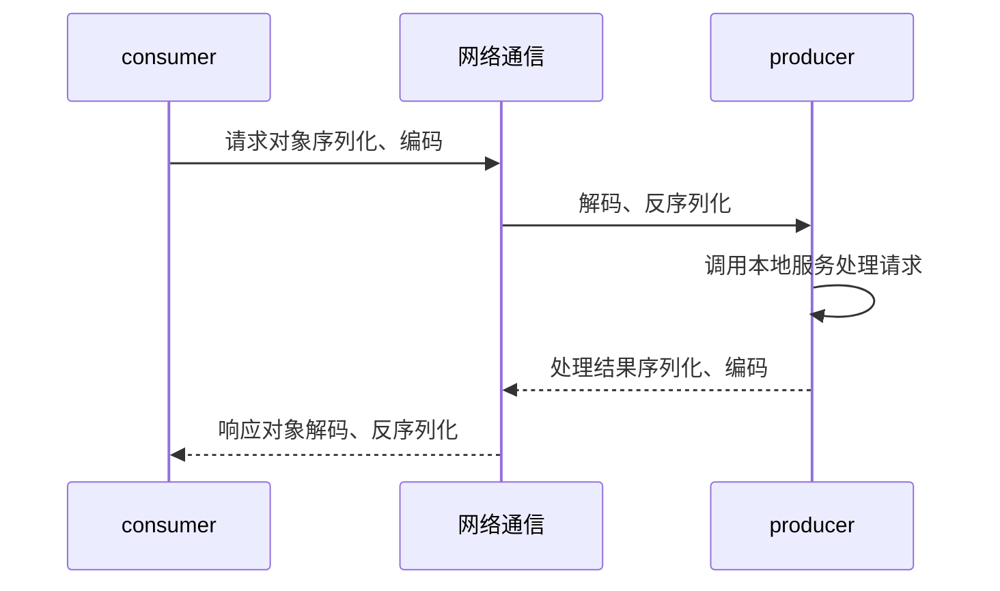

## Apache Dubbo 

### 认识dubbo

一款`rpc`框架，用于解决微服务架构下服务治理和通信问题。

（**服务治理**：服务发现、负载均衡、流量调度）

`RPC`：远程调用的一种技术概念，封装寻址和网络通信的细节，实现像本地方法调用一样的模式。


一次`RPC`调用过程：




#### 实现RPC 的关键

1. 代理

2. 序列化与反序列化：对象无法在网络中传输，需要转成二进制数据，此为序列化

3. 编码和解码

4. 网络通信：`IO`


#### RPC通信协议

**三种协议形式**

- 固定长度形式：每次读取固定长度解析

- 特殊字符隔断形式：根据特殊字符来判断读取协议单元结束

- `header + body` 形式：先解析头部，根据头部得到 `body` 的长度再解析 `body`

`dubbo`采用的是`header + body `形式的协议，同时使用特殊字符，解决网络粘包问题


#### `dubbo`支持协议

- `dubbo` 协议 (默认)

  - 连接个数：单连接
  - 连接方式：长连接
  - 传输协议：`TCP`
  - 传输方式：`NIO `异步传输
  - 序列化：`Hessian `二进制序列化
  - 适用范围：传入传出参数数据包较小（建议小于 100 K），消费者比提供者个数多，单一消费者无法压满提供者，尽量不要用 `dubbo` 协议传输大文件或超大字符串。
  - 适用场景：常规远程服务方法调用

- `rmi` 协议

  `RMI` 协议采用 `JDK` 标准的 `java.rmi.*` 实现，采用阻塞式短连接和 `JDK` 标准序列化方式。

  - 连接个数：多连接
  - 连接方式：短连接
  - 传输协议：`TCP`
  - 传输方式：同步传输
  - 序列化：`Java` 标准二进制序列化
  - 适用范围：传入传出参数数据包大小混合，消费者与提供者个数差不多，可传文件。
  - 适用场景：常规远程服务方法调用，与原生`RMI`服务互操作

- `hessian` 协议

  - 连接个数：多连接
  - 连接方式：短连接
  - 传输协议：`HTTP`
  - 传输方式：同步传输
  - 序列化：`Hessian`二进制序列化
  - 适用范围：传入传出参数数据包较大，提供者比消费者个数多，提供者压力较大，可传文件。
  - 适用场景：页面传输，文件传输，或与原生`hessian`服务互操作

- `gRPC`协议

- `http` 协议

  基于 `HTTP` 表单的远程调用协议

  - 连接个数：多连接
  - 连接方式：短连接
  - 传输协议：HTTP
  - 传输方式：同步传输
  - 序列化：表单序列化
  - 适用范围：传入传出参数数据包大小混合，提供者比消费者个数多，可用浏览器查看，可用表单或URL传入参数，暂不支持传文件。
  - 适用场景：需同时给应用程序和浏览器 `JS` 使用的服务

- `webservice` 协议

  - 连接个数：多连接
  - 连接方式：短连接
  - 传输协议：`HTTP`
  - 传输方式：同步传输
  - 序列化：`SOAP` 文本序列化
  - 适用场景：系统集成，跨语言调用

- `thrift` 协议

  适用于 `SOA` 标准` RPC` 框架

- `memcached` 协议

- `redis` 协议

- `rest` 协议

  基于标准的 `Java REST API` - `JAX-RS 2.0`（`Java API for RESTful Web Services` 的简写）实现的 `REST` 调用支持


#### 经典架构图


| 节点        | 角色说明                               |
| ----------- | -------------------------------------- |
| `Provider`  | 暴露服务的服务提供方                   |
| `Consumer`  | 调用远程服务的服务消费方               |
| `Registry`  | 服务注册与发现的注册中心               |
| `Monitor`   | 统计服务的调用次数和调用时间的监控中心 |
| `Container` | 服务运行容器                           |


#### 相关组件

- 注册中心

使用`zookeeper`（或`Nacos`）作为注册中心，协调`consumer`与`producer`之间地址的注册与发现

- 配置中心

使用`zookeeper`（或`Nacos`）作为配置中心

存储`dubbo`启动阶段的全局配置，保证配置的跨环境共享与全局一致性

负责服务治理规则（路由规则、动态配置）的存储与推送

- 元数据中心

使用`zookeeper`（或`Nacos`）作为元数据中心

接收`producer`上报的服务接口元数据，为`admin`等控制台提供运维能力


### 代码示例

1.准备`zookeeper`，配置中心，`dubbo`需要与`zookeeper`搭配使用

2.创建聚合工程 `springboot` 项目

（1）父`pom`依赖

```xml
<modules>
        <module>dubbo-producer</module>
        <module>dubbo-consumer</module>
    </modules>
<properties>
        <spring-boot.version>2.1.4.RELEASE</spring-boot.version>
        <dubbo.version>3.0.7</dubbo.version>
    </properties>
<dependencyManagement>
   <dependencies>
           <dependency>
               <groupId>org.springframework.boot</groupId>
               <artifactId>spring-boot-dependencies</artifactId>
               <version>${spring-boot.version}</version>
               <type>pom</type>
               <scope>import</scope>
           </dependency>

           <dependency>
               <groupId>org.apache.dubbo</groupId>
               <artifactId>dubbo-bom</artifactId>
               <version>${dubbo.version}</version>
               <type>pom</type>
               <scope>import</scope>
           </dependency>

           <dependency>
               <groupId>org.apache.dubbo</groupId>
               <artifactId>dubbo-dependencies-zookeeper</artifactId>
               <version>${dubbo.version}</version>
               <type>pom</type>
           </dependency>

   </dependencies>
</dependencyManagement>
```

2.创建子模块`producer module`

（1）`pom`依赖

```xml
<dependencies>
        <!-- dubbo -->
        <dependency>
            <groupId>org.apache.dubbo</groupId>
            <artifactId>dubbo</artifactId>
        </dependency>
        <dependency>
            <groupId>org.apache.dubbo</groupId>
            <artifactId>dubbo-dependencies-zookeeper</artifactId>
            <type>pom</type>
        </dependency>

        <!-- dubbo starter -->
        <dependency>
            <groupId>org.apache.dubbo</groupId>
            <artifactId>dubbo-spring-boot-starter</artifactId>
        </dependency>

        <!-- spring starter -->
        <dependency>
            <groupId>org.springframework.boot</groupId>
            <artifactId>spring-boot-starter</artifactId>
        </dependency>
        <dependency>
            <groupId>org.springframework.boot</groupId>
            <artifactId>spring-boot-autoconfigure</artifactId>
        </dependency>

    </dependencies>
```

（2）配置

```properties
server.port=9090
dubbo.application.name=dubbo-producer

dubbo.protocol.name=dubbo
dubbo.protocol.id=-1

dubbo.registry.id=zk-registry
dubbo.registry.address=zookeeper://127.0.0.1:2181

dubbo.config-center.address=zookeeper://127.0.0.1:2181
dubbo.metadata-report.address=zookeeper://127.0.0.1:2181
```

（3）定义服务接口

```java
public interface DemoService {
    String sayHello(String name);
}
```

（4）实现接口具体方法

实现类需要加`@DubboService`注解

```java
@DubboService
public class DemoServiceImpl implements DemoService {
    @Override
    public String sayHello(String name) {
        System.out.println("Hello " + name + ", request from consumer: " + RpcContext.getContext().getRemoteAddress());
        return "Hello " + name;
    }
}
```

（5）主程序类

使用`@EnableDubbo`注解

```java
@EnableDubbo
@SpringBootApplication(exclude = {DataSourceAutoConfiguration.class})
public class DubboProducerApplication {

    public static void main(String[] args) {
        SpringApplication.run(DubboProducerApplication.class, args);
    }

}
```

3.创建子模块`consumer module`

（1）`pom`依赖

```xml
<dependencies>
    <!-- dubbo -->
    <dependency>
        <groupId>org.apache.dubbo</groupId>
        <artifactId>dubbo</artifactId>
    </dependency>
    <dependency>
        <groupId>org.apache.dubbo</groupId>
        <artifactId>dubbo-dependencies-zookeeper</artifactId>
        <type>pom</type>
    </dependency>

    <!-- dubbo starter -->
    <dependency>
        <groupId>org.apache.dubbo</groupId>
        <artifactId>dubbo-spring-boot-starter</artifactId>
    </dependency>

    <!-- spring starter -->
    <dependency>
        <groupId>org.springframework.boot</groupId>
        <artifactId>spring-boot-starter</artifactId>
    </dependency>
    <dependency>
        <groupId>org.springframework.boot</groupId>
        <artifactId>spring-boot-autoconfigure</artifactId>
    </dependency>

    <!-- producer -->
    <dependency>
        <groupId>com.example</groupId>
        <artifactId>dubbo-producer</artifactId>
        <version>0.0.1-SNAPSHOT</version>
        <scope>compile</scope>
    </dependency>

</dependencies>
```

（2）配置

```properties
server.port=9091
dubbo.application.name=dubbo-consumer

dubbo.protocol.name=dubbo
dubbo.protocol.id=-1

dubbo.registry.id=zk-registry
dubbo.registry.address=zookeeper://127.0.0.1:2181

dubbo.config-center.address=zookeeper://127.0.0.1:2181
dubbo.metadata-report.address=zookeeper://127.0.0.1:2181
```

（3）引用远程服务接口

使用`@DubboReference`注解，引用远程服务接口

```java
@RestController
@RequestMapping("/consumer")
@Slf4j
public class TestController {
    @DubboReference
    private DemoService demoService;

    @RequestMapping("/user/{id}")
    public String getProduceService() {
        demoService.sayHello("I am consumer");
        return "get producer back success";
    }
}
```

（4）主程序类

使用`@EnableDubbo`注解

```java
@SpringBootApplication(exclude = {DataSourceAutoConfiguration.class})
@EnableDubbo
public class DubboConsumerApplication {

    public static void main(String[] args) {
        SpringApplication.run(DubboConsumerApplication.class, args);

    }

}
```

4.测试

请求接口`http://localhost:9091/consumer/user/1`，返回：


与此同时，服务端打印请求日志

```tex
Hello I am consumer, request from consumer: /172.31.2.43:61544
```

