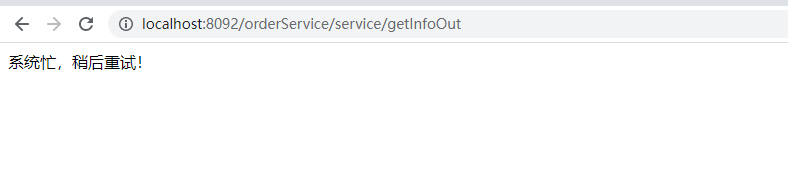
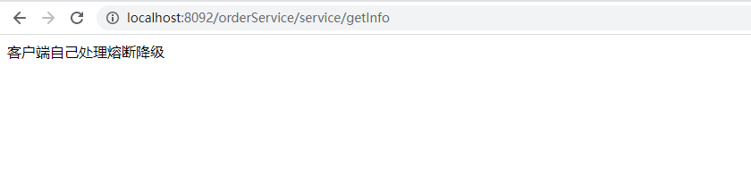
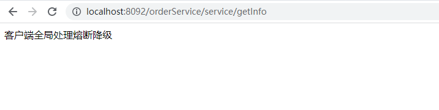
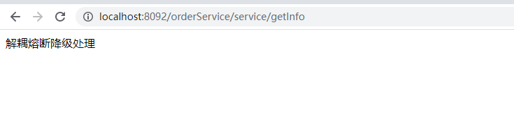

## Hystrix熔断器


在微服务架构中，当某个服务不可用，或出现故障，可能会导致调用它的服务线程等待，严重的出现多个服务阻塞，引发连锁的雪崩效应。

熔断器的思想就是，在中间服务出现故障是，向服务调用方返回一个预期的、可处理的降级响应，而不是返回调用方一个不能处理的异常。

`Spring Cloud Hystrix` 是基于 `Netflix` 公司的开源组件 `Hystrix` 实现的，它提供了熔断器功能，能够有效地阻止分布式微服务系统中出现联动故障，以提高微服务系统的弹性。`Spring Cloud Hystrix` 具有服务降级、服务熔断、线程隔离、请求缓存、请求合并以及实时故障监控等强大功能。


### 服务端降级演练

1.`producer`服务提供的接口

```java
@Controller
@RequestMapping("/orderService/service")
public class UserController {

    @Autowired
    private HystrixService hystrixService;

    @ResponseBody
    @RequestMapping("/getInfoOut")
    public String getInfoOut(){
        return hystrixService.getInfoTimeOut();
    }
}
```

2.业务类`HystrixService`

在方法上使用`@HystrixCommand`注解，`fallbackMethod`指定降级方法名称，`@HystrixProperty`指定特定的的异常情况；

`execution.isolation.thread.timeoutInMilliseconds` 用于设置调用超时时间的峰值，超出时间峰值则执行降级方法。

```java
@Service
public class HystrixServiceImpl implements HystrixService {
  
    @HystrixCommand(fallbackMethod = "dealTimeOut",
            commandProperties = {
                    @HystrixProperty(name = "execution.isolation.thread.timeoutInMilliseconds", value = "5000")})
    @Override
    public String getInfoTimeOut() {
        try {
            TimeUnit.SECONDS.sleep(6);
        } catch (InterruptedException e) {
            e.printStackTrace();
        }
        return "producer info return";
    }

    public String dealTimeOut() {
        return "系统忙，稍后重试";
    }
}
```

3.`consumer`服务调用

```java
@Controller
@RequestMapping("/orderService/service")
public class UserController {

    @Autowired
    FeignService feignService;

    @ResponseBody
    @RequestMapping("/getInfoOut")
    public String getInfoOut(){
        return feignService.getInfoOut();
    }
}
```

访问`http://localhost:8092/orderService/service/getInfoOut`接口，返回：



因为接口调用方法超时异常，断路器将方法请求打到了降级方法，故接口返回降级方法的响应信息。

### 客户端降级演练

1.调用方启动类添加使用`@EnableHystrix`注解

```java
@EnableFeignClients
@EnableHystrix
@SpringBootApplication
public class ConsumerApplication {

    public static void main(String[] args) {
        SpringApplication.run(ConsumerApplication.class, args);
    }

}
```

2.调用方接口方法使用`@HystrixCommand`注解

```java
@Controller
@RequestMapping("/orderService/service")
public class UserController {

    @Autowired
    FeignService feignService;

    @ResponseBody
    @RequestMapping("/getInfo")
    @HystrixCommand(fallbackMethod = "dealTimeOut")
    public String getInfo(){
        return feignService.getInfo();
    }

    public String dealTimeOut() {
        return "客户端自己处理熔断降级";
    }
}
```

3.服务提供方接口方法加一个6秒等待

```java
@Controller
@RequestMapping("/orderService/service")
public class UserController {

    @ResponseBody
    @RequestMapping("/getInfo")
    public String getInfo(){
        try {
            TimeUnit.SECONDS.sleep(6);
        } catch (InterruptedException e) {
            e.printStackTrace();
        }
        return "producer info";
    }
}
```

访问`http://localhost:8092/orderService/service/getInfo`接口，返回：



### 全局降级方法

1.在调用方`controller`类上使用注解`@DefaultProperties`，指定`defaultFallback`降级方法

2.在同类下创建全局的降级方法，此处`dealTimeOut()`

3.在接口方式上直接使用注解`@HystrixCommand`即可

```java
@DefaultProperties(defaultFallback = "dealTimeOut")
@Controller
@RequestMapping("/orderService/service")
public class UserController {
    
    @Autowired
    FeignService feignService;
    
    @HystrixCommand
    @ResponseBody
    @RequestMapping("/getInfo")
    public String getInfo(){
        return feignService.getInfo();
    }
    
    public String dealTimeOut() {
        return "客户端全局处理熔断降级";
    }
    
}
```

访问`http://localhost:8092/orderService/service/getInfo`接口，返回：



### 解耦熔断降级

1.新建一个实现类`FeignFallBackServiceImpl`，实现标注了`@FeignClient`注解的业务接口`FeignService`，此实现类里面的方法编写熔断逻辑

```java
@Component
public class FeignFallBackServiceImpl implements FeignService {

    @Override
    public String getInfo() {
        return "解耦熔断降级处理";
    }
}
```

2.业务接口`@FeignClient`注解里面指定`fallback`属性值，即为刚新建的实现类`FeignFallBackServiceImpl.class`

```java
@Component
@FeignClient(value = "producer-service", fallback = FeignFallBackServiceImpl.class)
public interface FeignService {

    @RequestMapping(value = "orderService/service/getInfo", method = RequestMethod.GET)
    String getInfo();
}
```

访问`http://localhost:8092/orderService/service/getInfo`接口，返回：




### 总结

本文通过代码示例介绍了`hystrix`熔断器在微服务项目开发中如何使用，从业务层粒度熔断降级处理，到全局熔断降级处理，以及解耦业务和熔断降级逻辑，更灵活的使用`hystrix`。

