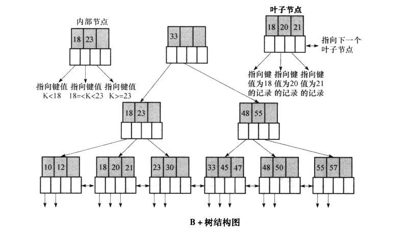

## 数据库 - Postgresql 数据库索引

> 对表中指定属性建立一个逻辑排序，索引就是维护这样一个排序关系，在对表进行查询的时候，走索引其实就是扫描已经过排序的数据，可以快速匹配，达到快速查询的目的。

### 5种索引方式

- 主键索引
- 唯一索引
- 多属性索引
- 部分索引
- 表达式索引

### 4种索引类型


- B-tree索引  
	
- hash索引
	
- gin倒排索引
	
- gist索引
	
#### B-tree索引

1. 创建索引

```sql
--CREATE INDEX命令创建索引，默认是创建的B-tree索引
CREATE INDEX test1_id_index ON test1 (id);
```
2. 使用场景

   `B-tree`可以处理对可以排序成某些顺序的数据的等式和范围查询

```sql
<
<=
=
>=
>
BETWEEN
IN
IS NULL
IS NOT NULL
LIKE
```

3. 示例

```sql
--往表test_tb1插入200000条测试数据
create table test_tb1(c1 int,c2 int);
insert into test_tb1 select round(random()*100),round(random()*1000) from generate_series(1,200000);
--查看数据表大小
select pg_size_pretty(pg_table_size('test_tb1'));
7104 kB

--全表扫描
select * from test_tb1;
0.209s
select count(*) from test_tb1;
0.079s

--比较单个字段索引和多个字段联合索引存储占用
--（1）创建c1单索引
create index test_tb1_idx1 on test_tb1(c1);
时间: 0.423s
select pg_size_pretty(pg_relation_size('test_tb1_idx1'));
4408 kB

drop index test_tb1_idx1;
--（2）创建c2单索引
create index test_tb1_idx2 on test_tb1(c2);
select pg_size_pretty(pg_relation_size('test_tb1_idx2'));
4408 kB

drop index test_tb1_idx2;
--（3）创建联合索引
create index test_tb1_idx3 on test_tb1(c1,c2);
select pg_size_pretty(pg_relation_size('test_tb1_idx3'));
4408 kB
--结论：创建单个索引和创建联合索引所占使用的磁盘空间相同

--执行计划分析
explain (analyze,buffers) select count(*) from test_tb1 where c1=99 and c2=999;
--该查询会走c1和c2联合索引
```

```sql
--插件
select * from pg_extension;
create extension pageinspect;

select * from heap_page_items(get_raw_page('test_tb1',0)) order by lp_off desc;

SELECT * from page_header(get_raw_page('test_tb1', 0));

create index test_tb1_idx1 on test_tb1(c1);
select * from bt_metap('test_tb1_idx1');   
select * from bt_page_stats('test_tb1_idx1',209); 
select * from bt_page_items('test_tb1_idx1',3); 

TRUNCATE table test_tb1;
drop table test_tb1;
```

4. 实现原理

   > b-tree索引基于B+树实现

   B+树数据结构

   - B+树中所有关键字都在叶子节点出现，并且按照关键字排序以链表方式链接，同时叶子节点保存了指向相应记录的指针
   - 所有非叶子节点可以看成是索引的一部分，并不指向实际的存储位置，非叶子节点包含其子树节点中最小的关键字

   B+树结构图

   

   使用B+树实现的优点：压缩了树的层级，减少磁盘IO。

#### hash索引  

> 使用hash函数，对关键字进行散列

1. 创建索引

```sql
CREATE INDEX name ON table USING HASH (column);
```

2. 使用场景

   Hash索引只能处理简单的等式比较。当使用`=`运算符进行比较时，查询计划器将考虑使用Hash索引

3. 实现原理

   构建可动态扩展的hash表

#### gist

意为通用搜索树，严格来说，gist不是一种独立的索引类型，而是一种索引架构或者模板，可以在这种架构上实现不同的索引策略

#### gin倒排索引  

> 存储对（key, posting list）集合的索引结构

当需要搜索多值类型内的VALUE时，适合多值类型，例如数组、全文检索

``` sql
<@  包含于
@>  数组的操作符，表示“包含”的意思
=   相等
&&  重叠（是否有相同元素）
```

### 索引被使用率查看  

```sql
SELECT
	pg_stat_all_indexes.relid,
	pg_stat_all_indexes.indexrelid,
	pg_stat_all_indexes.schemaname,
	pg_stat_all_indexes.relname,
	pg_stat_all_indexes.indexrelname,
	pg_stat_all_indexes.idx_scan,
	pg_stat_all_indexes.idx_tup_read,
	pg_stat_all_indexes.idx_tup_fetch 
FROM
	pg_stat_all_indexes 
WHERE
	( pg_stat_all_indexes.schemaname <> ALL ( ARRAY [ 'pg_catalog' :: NAME, 'information_schema' :: NAME ] ) ) 
	AND pg_stat_all_indexes.schemaname !~ '^pg_toast' :: TEXT;
```


## 事务处理

> `Postgresql`使用两阶段提交来支持分布式数据库的事务处理
>
> `Postgresql`支持两阶段提交协议，并且提供了相关的操作接口，但是没有实现整个协议，两阶段协议的整个流程需要开发者在应用程序中保证

1. 预提交阶段 `prepare transaction`
2. 全局提交阶段 `commit prepared` | `rollback prepared`


## 并发控制

> `Postgresql` 利用`MVCC` （多版本并发控制）来维护数据的一致性
>
> `MVCC`不能解决所有的并发控制情况，`Postgresql`还提供了会话锁机制，一次加锁可以对多个事务有效

`SQL`标准考虑了三个必须在并行事务之间避免的现象

（1）脏堵：一个事务读取了另一个事务还未提交的数据

（2）不可重复读：一个事务读取前面读取过的数据，发现该数据已经被另一个已提交的事务修改过

（3）幻读：一个事务重新执行一次查询，发现返回的数据因为最近其他已经提交的事务发生了改变

为了避免这几个现象，`SQL`标准定义了四个事务隔离级别

- 读未提交
- 可重复读
- 读已提交
- 串行化

### `Postgresql`的三种锁

`SpinLock`

`LWLock`

`RegularLock`

### 多版本并发控制