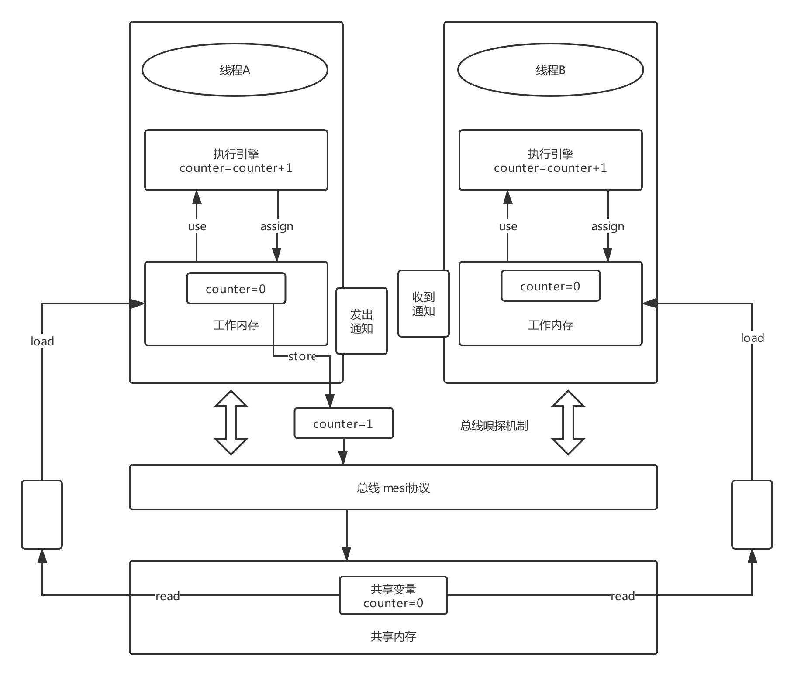

# 知识点  

## 一、计算机基础  

**机器数: 原码 补码 反码**

> 练习： [x]补=1 1110100， [y]补=10110000。若整型变量 z=2*x+y/2，则 z 的机器数为（ ）。
```
第一步：根据补码算反码（正数的补码与其原码相同；负数的补码是在其反码的末位加1）

反码: x: 11110011   y: 10101111

第二步：根据反码算原码（正数的反码与其原码相同；负数的反码是对其原码逐位取反，符号位除外）

原码: x: 10001100   y: 11010000

第三步：分别计算2*x和y/2

10001100 向左移一位
2*x =  10011000

11010000  向右移一位
y/2 = 10101000

第四步：计算2*x+y/2

10011000
+  10101000

z=2*x+y/2 = 11000000


```


## 二、Java基础    

**1.String** :

    1.String常量池：字符串常量放在常量池中实现复用，指向常量池中同一个内存地址；
    
    2.为什么String是不可变的：成员变量final，并且没有set方法来修改

**2.new**：

	创建新的对象，指向全新的内存地址；
	
	String类的intern方法创建返回一个常量池中的固定对象

**3.static**

**4.final**

**5.transient**

**6.反射**

> 原理
>
> 应用场景

**7.抽象类与接口**

>

## 三、集合

> ArrayList、 LinkedList
>
> HashMap、
>
> ConcurrentHashMap
>
> ​	锁分段技术
> ​	读是否加锁，why
> ​	迭代器是强一致性还是弱一致性的迭代器	
>
>  HashSet
>
> set如何保证不重复
>
> concurrentHashMap内部原理，如何保证线程安全


## 四、IO 

>HTTP/tcp/udp网络协议原理
>BIO/NIO
>netty


## 五、java并发  

**sleep与wait**：

    Thread.sleep() 释放CPU资源，不释放锁
    
    Object.wait() 释放锁，需要notify唤醒线程，重新获取锁；

**notify与notifyall**：

    notify唤醒一个线程，并允许它去获取锁
    
    notifyall唤醒所有等待这个对象的线程，允许他们去获取对象锁；
    
    //注意：如果要把notify和wait方法放在一起用的话，必须先调用notify后调用wait，因为如果调用完wait，该线程就已经不是current thread了。

**Synchronized与volatile**：

     Synchronized：
    
    	同步方法：线程A调用加锁的A方法，或得到对象锁，等A方法执行完，其他线程才能调用A方法
    	同步代码块：缩小同步范围，提高执行效率，可指定锁对象	
    	加到static方法给class类上锁，加到非静态方法是给对象上锁
    	锁重入：线程得到对象锁后，再次请求此对象锁，可再次得到；在Synchronized方法内部再次调用其他
    
     volatile：
    
    	修饰变量，保证最新；
    	使变量在多个线程间可见；强制从公共堆栈取得变量值，而不是从线程私有数据栈取值

**同步锁，互斥锁**

>

**join方法**：

    等待子线程终止；
    
    join方法的原理就是调用wait方法进行等待操作，子线程执行完JVM会自动调用notify方法唤醒主线程，主线程继续执行；

**线程的状态**

>  新建、就绪、运行、阻塞、死亡

**ReentrantLock**

**Lock接口和Synchronized比较**

**ThreadLocal,ThreadLocalMap**

>  ThreadLocal为每一个线程提供独立的变量副本，隔离了多个线程对数据的访问冲突；

**submit和excute**

**FutureTask**

**乐观锁和悲观锁**

**死锁**

**分布式锁有哪些，怎么实现的**

**cas**

## 六、事务  

**数据库事务隔离级别**  

    1.读未提交；导致脏读
    
    2.读提交；不可重复读，幻读
    
    3.重复读；多次读是一致的
    
    4.串行化；所有事务串行执行

**读写锁**

**事务管理器**

**声明式事务实现原理：**

**如何回滚事务**：

>  在上下文正在执行的代码中出现异常，事务代码会捕获异常，做出回滚决定 

## 七、JVM

### 1.JVM内存区域


**Java定位内存溢出**

### 2.JVM内存模型



### 3.Java类加载机制 

类加载过程：加载-》验证-》准备-》解析-》初始化 


## 八、中间件  

**1.Tomcat实现原理**

	Tomcat容器运行机制
	类加载机制
	核心组件
	Tomcat优化

**2.集群数据库同步问题**  

**3.redis**

	实现消息队列，队列满了怎么办，消费不完怎么办
	
	分布式锁
**4.消息队列**

	disruptor单机性能最高的MQ，600w QPS/sec

## 九、jdk源码

### 1.锁的设计与实现

**锁的特性**

  > 1.排他性（互斥） -- 》跨线程可见性
  >
  > 2.公平性与非公平性（是否可以不排队）
  >
  > 3.没有获得锁的线程等待（阻塞）
  >
  > 4.锁的获得和释放的方法
  >
  > 5.是否支持重入（避免死锁）
  >
  > 6.锁的作用范围（控制粒度提升性能）

**锁的状态**

> 偏向锁（是否有存在的必要？） -》 开关（允许关闭或打开）
>
> ​	通过cas的方式，把当前锁偏向于线程A
>
> ​	同一时间只有一个线程来访问
>
> 轻量级锁
>
> ​	背景：在大多数情况下，线程获得和释放锁的时间很短
>
> ​	竞争不是特别激烈的情况
>
> ​	自旋锁的方式去尝试获得锁
>
> ​	临界点：CPU的资源开销
>
> 重量级锁 -》比较耗性能
>
> ​	竞争很激烈
>
> ​	self->_ParkEvent->park();